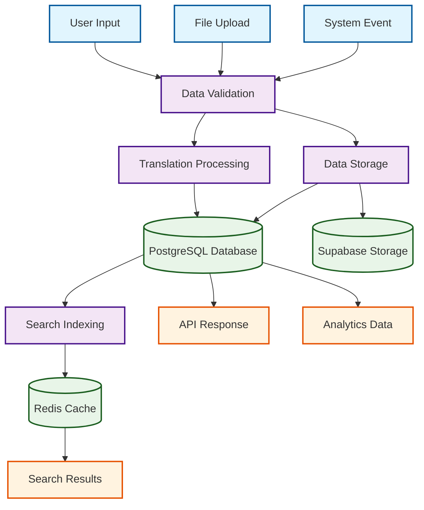
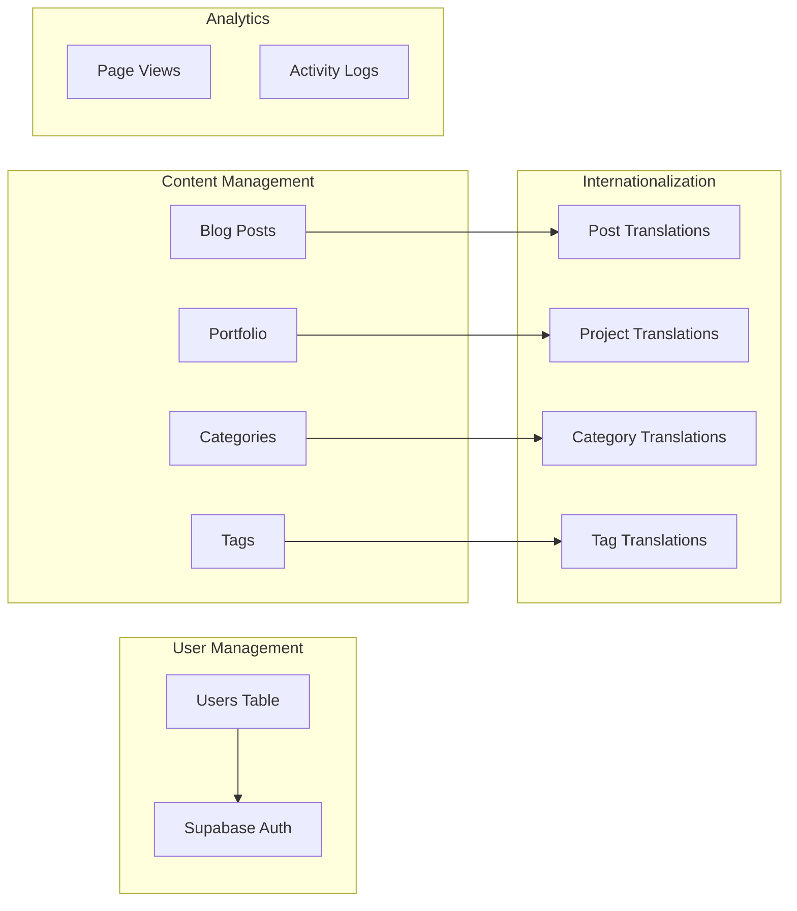

# Database Schema Diagram

## Complete Database Schema

```mermaid
erDiagram
    %% Core User Management
    users {
        uuid id PK
        string email UK
        string full_name
        string role
        timestamp created_at
        timestamp updated_at
        timestamp last_login
    }

    %% Blog Posts
    blog_posts {
        int id PK
        string slug UK
        string status
        string thumbnail_url
        timestamp published_at
        timestamp created_at
        timestamp updated_at
        int view_count
    }

    %% Blog Post Translations
    blog_post_translations {
        int blog_post_id PK,FK
        string language_code PK
        string title
        string summary
        text content
        timestamp created_at
        timestamp updated_at
    }

    %% Portfolio Projects
    portfolio_projects {
        int id PK
        string slug UK
        string status
        string thumbnail_url
        timestamp created_at
        timestamp updated_at
    }

    %% Portfolio Translations
    portfolio_translations {
        int project_id PK,FK
        string language_code PK
        string title
        string description
        text content
        timestamp created_at
        timestamp updated_at
    }

    %% Categories
    categories {
        int id PK
        string slug UK
        timestamp created_at
        timestamp updated_at
    }

    %% Category Translations
    category_translations {
        int category_id PK,FK
        string language_code PK
        string name
        string description
        timestamp created_at
        timestamp updated_at
    }

    %% Tags
    tags {
        int id PK
        string slug UK
        timestamp created_at
        timestamp updated_at
    }

    %% Tag Translations
    tag_translations {
        int tag_id PK,FK
        string language_code PK
        string name
        timestamp created_at
        timestamp updated_at
    }

    %% Relationship Tables
    blog_post_categories {
        int blog_post_id PK,FK
        int category_id PK,FK
        timestamp created_at
    }

    blog_post_tags {
        int blog_post_id PK,FK
        int tag_id PK,FK
        timestamp created_at
    }

    %% Analytics Tables
    page_views {
        int id PK
        string page_url
        string user_agent
        string ip_address
        timestamp created_at
    }

    activity_logs {
        int id PK
        uuid user_id FK
        string action
        jsonb details
        timestamp created_at
    }

    %% About Me
    about_me {
        int id PK
        string language_code PK
        text content
        timestamp created_at
        timestamp updated_at
    }

    %% Relationships
    users ||--o{ activity_logs : "performs"
    blog_posts ||--o{ blog_post_translations : "has"
    blog_posts ||--o{ blog_post_categories : "belongs_to"
    blog_posts ||--o{ blog_post_tags : "has"
    portfolio_projects ||--o{ portfolio_translations : "has"
    categories ||--o{ category_translations : "has"
    categories ||--o{ blog_post_categories : "contains"
    tags ||--o{ tag_translations : "has"
    tags ||--o{ blog_post_tags : "labels"
```

## Database Relationships

```mermaid
graph TB
    %% Core Entities
    Users[Users]
    Posts[Blog Posts]
    Projects[Portfolio Projects]
    Categories[Categories]
    Tags[Tags]

    %% Translation Entities
    PostTranslations[Post Translations]
    ProjectTranslations[Project Translations]
    CategoryTranslations[Category Translations]
    TagTranslations[Tag Translations]

    %% Junction Tables
    PostCategories[Post-Category Junction]
    PostTags[Post-Tag Junction]

    %% Analytics
    PageViews[Page Views]
    ActivityLogs[Activity Logs]
    AboutMe[About Me]

    %% Relationships
    Users --> ActivityLogs
    Posts --> PostTranslations
    Posts --> PostCategories
    Posts --> PostTags
    Projects --> ProjectTranslations
    Categories --> CategoryTranslations
    Categories --> PostCategories
    Tags --> TagTranslations
    Tags --> PostTags

    %% Styling
    classDef coreClass fill:#e8f5e8,stroke:#2e7d32,stroke-width:2px
    classDef translationClass fill:#e3f2fd,stroke:#1565c0,stroke-width:2px
    classDef junctionClass fill:#fff3e0,stroke:#e65100,stroke-width:2px
    classDef analyticsClass fill:#fce4ec,stroke:#c2185b,stroke-width:2px

    class Users,Posts,Projects,Categories,Tags coreClass
    class PostTranslations,ProjectTranslations,CategoryTranslations,TagTranslations translationClass
    class PostCategories,PostTags junctionClass
    class PageViews,ActivityLogs,AboutMe analyticsClass
```

## Data Flow Diagram

## Table Structure Details

### Core Tables

### Key Features of Schema

1. **Internationalization Support**
   - Separate translation tables for all content
   - Language-specific content management
   - Fallback language handling

2. **Content Organization**
   - Categories for broad content organization
   - Tags for detailed content tagging
   - Many-to-many relationships

3. **Analytics & Tracking**
   - Page view tracking
   - User activity logging
   - Performance monitoring

4. **Security**
   - Row Level Security (RLS) policies
   - User role management
   - Audit trail through activity logs

5. **Performance**
   - Optimized indexes on frequently queried fields
   - Efficient relationship queries
   - Caching strategies 