# Database Schema Diagram
## Matt Dinh Blog Platform

**Version**: 2.0  
**Date**: December 2024  
**Status**: Core Schema Complete ✅

**Update (2024-07-19):**
- Admin blog edit and create forms now include robust unsaved changes protection. All navigation (breadcrumbs, nav bar, <a>, <Link>, router) is protected by a confirmation popup if there are unsaved changes, implemented via a reusable hook and Breadcrumbs prop.

---

## Database Schema Overview

The Matt Dinh Blog platform uses a PostgreSQL database with a normalized schema designed for bilingual content management, user authentication, and content organization.

---

## Entity Relationship Diagram

```mermaid
erDiagram
    %% Core Content Tables
    blog_posts {
        serial id PK
        varchar slug UK "URL-friendly identifier"
        text status "published, draft, archived"
        timestamp published_at "Publication date"
        timestamp created_at "Creation timestamp"
        timestamp updated_at "Last update timestamp"
        varchar thumbnail_url "Featured image URL"
        int category_id FK "Category reference"
        uuid author_id FK "Author reference"
        int view_count "View counter"
    }
    
    blog_post_translations {
        serial id PK
        int blog_post_id FK "Post reference"
        varchar language_code "vi, en"
        text title "Post title"
        text summary "Post summary"
        text content "Full post content"
        text meta_title "SEO title"
        text meta_description "SEO description"
        timestamp created_at "Creation timestamp"
        timestamp updated_at "Last update timestamp"
    }
    
    categories {
        serial id PK
        varchar slug UK "URL-friendly identifier"
        timestamp created_at "Creation timestamp"
        timestamp updated_at "Last update timestamp"
    }
    
    category_translations {
        serial id PK
        int category_id FK "Category reference"
        varchar language_code "vi, en"
        text name "Category name"
        text description "Category description"
        timestamp created_at "Creation timestamp"
        timestamp updated_at "Last update timestamp"
    }
    
    %% User Management Tables
    users {
        uuid id PK "Supabase Auth user ID"
        varchar email "User email"
        text role "admin, user"
        timestamp created_at "Account creation"
        timestamp updated_at "Last update"
        boolean is_active "Account status"
    }
    
    %% About Me Tables
    about_me {
        serial id PK
        varchar slug UK "URL-friendly identifier"
        timestamp created_at "Creation timestamp"
        timestamp updated_at "Last update timestamp"
    }
    
    about_me_translations {
        serial id PK
        int about_me_id FK "About me reference"
        varchar language_code "vi, en"
        text title "Page title"
        text content "Page content"
        timestamp created_at "Creation timestamp"
        timestamp updated_at "Last update timestamp"
    }
    
    %% Portfolio Tables
    portfolio_projects {
        serial id PK
        varchar slug UK "URL-friendly identifier"
        text status "published, draft, archived"
        timestamp published_at "Publication date"
        timestamp created_at "Creation timestamp"
        timestamp updated_at "Last update timestamp"
        varchar thumbnail_url "Project thumbnail"
        varchar demo_url "Live demo URL"
        varchar github_url "GitHub repository"
        int view_count "View counter"
    }
    
    portfolio_translations {
        serial id PK
        int portfolio_project_id FK "Project reference"
        varchar language_code "vi, en"
        text title "Project title"
        text description "Project description"
        text content "Detailed content"
        text meta_title "SEO title"
        text meta_description "SEO description"
        timestamp created_at "Creation timestamp"
        timestamp updated_at "Last update timestamp"
    }
    
    %% Tag System Tables
    tags {
        serial id PK
        varchar slug UK "URL-friendly identifier"
        timestamp created_at "Creation timestamp"
        timestamp updated_at "Last update timestamp"
    }
    
    tag_translations {
        serial id PK
        int tag_id FK "Tag reference"
        varchar language_code "vi, en"
        text name "Tag name"
        text description "Tag description"
        timestamp created_at "Creation timestamp"
        timestamp updated_at "Last update timestamp"
    }
    
    %% Junction Tables
    blog_post_tags {
        int blog_post_id FK "Post reference"
        int tag_id FK "Tag reference"
        timestamp created_at "Creation timestamp"
    }
    
    portfolio_project_tags {
        int portfolio_project_id FK "Project reference"
        int tag_id FK "Tag reference"
        timestamp created_at "Creation timestamp"
    }
    
    %% Activity Logging
    activity_logs {
        serial id PK
        uuid user_id FK "User reference"
        text action "Action performed"
        text entity_type "Type of entity"
        int entity_id "Entity ID"
        jsonb details "Additional details"
        timestamp created_at "Action timestamp"
    }
    
    %% Shared Images
    shared_images {
        serial id PK
        varchar filename "Image filename"
        varchar url "Image URL"
        varchar alt_text "Alt text"
        varchar caption "Image caption"
        int width "Image width"
        int height "Image height"
        varchar mime_type "MIME type"
        bigint file_size "File size in bytes"
        uuid uploaded_by FK "Uploader reference"
        timestamp created_at "Upload timestamp"
        timestamp updated_at "Last update timestamp"
    }
    
    %% Relationships
    blog_posts ||--o{ blog_post_translations : "has translations"
    blog_posts }o--|| categories : "belongs to"
    categories ||--o{ category_translations : "has translations"
    blog_posts }o--|| users : "created by"
    about_me ||--o{ about_me_translations : "has translations"
    portfolio_projects ||--o{ portfolio_translations : "has translations"
    tags ||--o{ tag_translations : "has translations"
    blog_posts }o--o{ tags : "tagged with"
    portfolio_projects }o--o{ tags : "tagged with"
    users ||--o{ activity_logs : "performs actions"
    users ||--o{ shared_images : "uploads images"
```



---

## Table Structure Details

### Core Content Tables

#### blog_posts
The main table storing blog post metadata and relationships.

```sql
CREATE TABLE blog_posts (
    id SERIAL PRIMARY KEY,
    slug VARCHAR(255) UNIQUE NOT NULL,
    status TEXT DEFAULT 'draft',
    published_at TIMESTAMP WITH TIME ZONE,
    created_at TIMESTAMP WITH TIME ZONE DEFAULT NOW(),
    updated_at TIMESTAMP WITH TIME ZONE DEFAULT NOW(),
    thumbnail_url VARCHAR(500),
    category_id INTEGER REFERENCES categories(id),
    author_id UUID REFERENCES auth.users(id),
    view_count INTEGER DEFAULT 0
);
```

#### blog_post_translations
Stores bilingual content for blog posts.

```sql
CREATE TABLE blog_post_translations (
    id SERIAL PRIMARY KEY,
    blog_post_id INTEGER REFERENCES blog_posts(id) ON DELETE CASCADE,
    language_code VARCHAR(2) NOT NULL,
    title TEXT NOT NULL,
    summary TEXT,
    content TEXT,
    meta_title TEXT,
    meta_description TEXT,
    created_at TIMESTAMP WITH TIME ZONE DEFAULT NOW(),
    updated_at TIMESTAMP WITH TIME ZONE DEFAULT NOW(),
    UNIQUE(blog_post_id, language_code)
);
```

### Category Management

#### categories
Stores content categories for organization.

```sql
CREATE TABLE categories (
    id SERIAL PRIMARY KEY,
    slug VARCHAR(255) UNIQUE NOT NULL,
    created_at TIMESTAMP WITH TIME ZONE DEFAULT NOW(),
    updated_at TIMESTAMP WITH TIME ZONE DEFAULT NOW()
);
```

#### category_translations
Bilingual category names and descriptions.

```sql
CREATE TABLE category_translations (
    id SERIAL PRIMARY KEY,
    category_id INTEGER REFERENCES categories(id) ON DELETE CASCADE,
    language_code VARCHAR(2) NOT NULL,
    name TEXT NOT NULL,
    description TEXT,
    created_at TIMESTAMP WITH TIME ZONE DEFAULT NOW(),
    updated_at TIMESTAMP WITH TIME ZONE DEFAULT NOW(),
    UNIQUE(category_id, language_code)
);
```

### User Management

#### users
Extended user information beyond Supabase Auth.

```sql
CREATE TABLE users (
    id UUID PRIMARY KEY REFERENCES auth.users(id),
    email VARCHAR(255) NOT NULL,
    role TEXT DEFAULT 'user',
    created_at TIMESTAMP WITH TIME ZONE DEFAULT NOW(),
    updated_at TIMESTAMP WITH TIME ZONE DEFAULT NOW(),
    is_active BOOLEAN DEFAULT true
);
```

### About Me Content

#### about_me
Main about me page metadata.

```sql
CREATE TABLE about_me (
    id SERIAL PRIMARY KEY,
    slug VARCHAR(255) UNIQUE NOT NULL,
    created_at TIMESTAMP WITH TIME ZONE DEFAULT NOW(),
    updated_at TIMESTAMP WITH TIME ZONE DEFAULT NOW()
);
```

#### about_me_translations
Bilingual about me content.

```sql
CREATE TABLE about_me_translations (
    id SERIAL PRIMARY KEY,
    about_me_id INTEGER REFERENCES about_me(id) ON DELETE CASCADE,
    language_code VARCHAR(2) NOT NULL,
    title TEXT NOT NULL,
    content TEXT,
    created_at TIMESTAMP WITH TIME ZONE DEFAULT NOW(),
    updated_at TIMESTAMP WITH TIME ZONE DEFAULT NOW(),
    UNIQUE(about_me_id, language_code)
);
```

### Portfolio System

#### portfolio_projects
Portfolio project metadata and links.

```sql
CREATE TABLE portfolio_projects (
    id SERIAL PRIMARY KEY,
    slug VARCHAR(255) UNIQUE NOT NULL,
    status TEXT DEFAULT 'draft',
    published_at TIMESTAMP WITH TIME ZONE,
    created_at TIMESTAMP WITH TIME ZONE DEFAULT NOW(),
    updated_at TIMESTAMP WITH TIME ZONE DEFAULT NOW(),
    thumbnail_url VARCHAR(500),
    demo_url VARCHAR(500),
    github_url VARCHAR(500),
    view_count INTEGER DEFAULT 0
);
```

#### portfolio_translations
Bilingual portfolio project content.

```sql
CREATE TABLE portfolio_translations (
    id SERIAL PRIMARY KEY,
    portfolio_project_id INTEGER REFERENCES portfolio_projects(id) ON DELETE CASCADE,
    language_code VARCHAR(2) NOT NULL,
    title TEXT NOT NULL,
    description TEXT,
    content TEXT,
    meta_title TEXT,
    meta_description TEXT,
    created_at TIMESTAMP WITH TIME ZONE DEFAULT NOW(),
    updated_at TIMESTAMP WITH TIME ZONE DEFAULT NOW(),
    UNIQUE(portfolio_project_id, language_code)
);
```

### Tag System

#### tags
Content tags for categorization.

```sql
CREATE TABLE tags (
    id SERIAL PRIMARY KEY,
    slug VARCHAR(255) UNIQUE NOT NULL,
    created_at TIMESTAMP WITH TIME ZONE DEFAULT NOW(),
    updated_at TIMESTAMP WITH TIME ZONE DEFAULT NOW()
);
```

#### tag_translations
Bilingual tag names and descriptions.

```sql
CREATE TABLE tag_translations (
    id SERIAL PRIMARY KEY,
    tag_id INTEGER REFERENCES tags(id) ON DELETE CASCADE,
    language_code VARCHAR(2) NOT NULL,
    name TEXT NOT NULL,
    description TEXT,
    created_at TIMESTAMP WITH TIME ZONE DEFAULT NOW(),
    updated_at TIMESTAMP WITH TIME ZONE DEFAULT NOW(),
    UNIQUE(tag_id, language_code)
);
```

### Junction Tables

#### blog_post_tags
Many-to-many relationship between posts and tags.

```sql
CREATE TABLE blog_post_tags (
    blog_post_id INTEGER REFERENCES blog_posts(id) ON DELETE CASCADE,
    tag_id INTEGER REFERENCES tags(id) ON DELETE CASCADE,
    created_at TIMESTAMP WITH TIME ZONE DEFAULT NOW(),
    PRIMARY KEY (blog_post_id, tag_id)
);
```

#### portfolio_project_tags
Many-to-many relationship between projects and tags.

```sql
CREATE TABLE portfolio_project_tags (
    portfolio_project_id INTEGER REFERENCES portfolio_projects(id) ON DELETE CASCADE,
    tag_id INTEGER REFERENCES tags(id) ON DELETE CASCADE,
    created_at TIMESTAMP WITH TIME ZONE DEFAULT NOW(),
    PRIMARY KEY (portfolio_project_id, tag_id)
);
```

### Activity Logging

#### activity_logs
System activity tracking for audit purposes.

```sql
CREATE TABLE activity_logs (
    id SERIAL PRIMARY KEY,
    user_id UUID REFERENCES auth.users(id),
    action TEXT NOT NULL,
    entity_type TEXT NOT NULL,
    entity_id INTEGER,
    details JSONB,
    created_at TIMESTAMP WITH TIME ZONE DEFAULT NOW()
);
```

### Shared Images

#### shared_images
Centralized image management system.

```sql
CREATE TABLE shared_images (
    id SERIAL PRIMARY KEY,
    filename VARCHAR(255) NOT NULL,
    url VARCHAR(500) NOT NULL,
    alt_text TEXT,
    caption TEXT,
    width INTEGER,
    height INTEGER,
    mime_type VARCHAR(100),
    file_size BIGINT,
    uploaded_by UUID REFERENCES auth.users(id),
    created_at TIMESTAMP WITH TIME ZONE DEFAULT NOW(),
    updated_at TIMESTAMP WITH TIME ZONE DEFAULT NOW()
);
```

---

## Database Indexes

### Performance Indexes

```sql
-- Blog posts indexes
CREATE INDEX idx_blog_posts_status ON blog_posts(status);
CREATE INDEX idx_blog_posts_published_at ON blog_posts(published_at DESC);
CREATE INDEX idx_blog_posts_category_id ON blog_posts(category_id);
CREATE INDEX idx_blog_posts_author_id ON blog_posts(author_id);

-- Translation indexes
CREATE INDEX idx_blog_post_translations_language ON blog_post_translations(language_code);
CREATE INDEX idx_blog_post_translations_post_lang ON blog_post_translations(blog_post_id, language_code);

-- Category indexes
CREATE INDEX idx_category_translations_language ON category_translations(language_code);
CREATE INDEX idx_category_translations_category_lang ON category_translations(category_id, language_code);

-- Portfolio indexes
CREATE INDEX idx_portfolio_projects_status ON portfolio_projects(status);
CREATE INDEX idx_portfolio_projects_published_at ON portfolio_projects(published_at DESC);

-- Tag indexes
CREATE INDEX idx_blog_post_tags_post_id ON blog_post_tags(blog_post_id);
CREATE INDEX idx_blog_post_tags_tag_id ON blog_post_tags(tag_id);

-- Activity log indexes
CREATE INDEX idx_activity_logs_user_id ON activity_logs(user_id);
CREATE INDEX idx_activity_logs_created_at ON activity_logs(created_at DESC);
CREATE INDEX idx_activity_logs_entity ON activity_logs(entity_type, entity_id);

-- Shared images indexes
CREATE INDEX idx_shared_images_uploaded_by ON shared_images(uploaded_by);
CREATE INDEX idx_shared_images_created_at ON shared_images(created_at DESC);
```

---

## Row Level Security (RLS) Policies

### Public Read Access

```sql
-- Blog posts - public read access
ALTER TABLE blog_posts ENABLE ROW LEVEL SECURITY;
CREATE POLICY "Public can view published posts" ON blog_posts
    FOR SELECT USING (status = 'published');

-- Blog post translations - public read access
ALTER TABLE blog_post_translations ENABLE ROW LEVEL SECURITY;
CREATE POLICY "Public can view translations" ON blog_post_translations
    FOR SELECT USING (true);

-- Categories - public read access
ALTER TABLE categories ENABLE ROW LEVEL SECURITY;
CREATE POLICY "Public can view categories" ON categories
    FOR SELECT USING (true);

-- Category translations - public read access
ALTER TABLE category_translations ENABLE ROW LEVEL SECURITY;
CREATE POLICY "Public can view category translations" ON category_translations
    FOR SELECT USING (true);
```

### Admin Full Access

```sql
-- Admin full access to blog posts
CREATE POLICY "Admins have full access to posts" ON blog_posts
    FOR ALL USING (
        EXISTS (
            SELECT 1 FROM users 
            WHERE users.id = auth.uid() 
            AND users.role = 'admin'
        )
    );

-- Admin full access to translations
CREATE POLICY "Admins have full access to translations" ON blog_post_translations
    FOR ALL USING (
        EXISTS (
            SELECT 1 FROM users 
            WHERE users.id = auth.uid() 
            AND users.role = 'admin'
        )
    );
```

### User-Specific Access

```sql
-- Users can view their own posts
CREATE POLICY "Users can view own posts" ON blog_posts
    FOR SELECT USING (author_id = auth.uid());

-- Users can edit their own posts
CREATE POLICY "Users can edit own posts" ON blog_posts
    FOR UPDATE USING (author_id = auth.uid());
```

---

## Database Views

### Published Posts View

```sql
CREATE VIEW published_posts AS
SELECT 
    bp.id,
    bp.slug,
    bp.status,
    bp.published_at,
    bp.thumbnail_url,
    bp.category_id,
    bp.author_id,
    bp.view_count,
    bpt.language_code,
    bpt.title,
    bpt.summary,
    bpt.content,
    bpt.meta_title,
    bpt.meta_description,
    c.slug as category_slug,
    ct.name as category_name
FROM blog_posts bp
JOIN blog_post_translations bpt ON bp.id = bpt.blog_post_id
LEFT JOIN categories c ON bp.category_id = c.id
LEFT JOIN category_translations ct ON c.id = ct.category_id 
    AND ct.language_code = bpt.language_code
WHERE bp.status = 'published'
ORDER BY bp.published_at DESC;
```

### Post Statistics View

```sql
CREATE VIEW post_statistics AS
SELECT 
    bp.id,
    bp.slug,
    bp.title,
    bp.view_count,
    bp.published_at,
    COUNT(bpt.id) as translation_count,
    STRING_AGG(bpt.language_code, ', ') as languages
FROM blog_posts bp
LEFT JOIN blog_post_translations bpt ON bp.id = bpt.blog_post_id
GROUP BY bp.id, bp.slug, bp.title, bp.view_count, bp.published_at
ORDER BY bp.published_at DESC;
```

---

## Data Migration Scripts

### Initial Setup

```sql
-- Create tables in correct order
-- 1. Categories (no dependencies)
-- 2. Tags (no dependencies)
-- 3. Blog posts (depends on categories)
-- 4. Translations (depend on parent tables)
-- 5. Junction tables (depend on both parent tables)

-- Enable RLS on all tables
-- Create indexes for performance
-- Insert default data
```

### Sample Data Insertion

```sql
-- Insert default categories
INSERT INTO categories (slug) VALUES 
('technology'),
('lifestyle'),
('travel'),
('programming');

-- Insert category translations
INSERT INTO category_translations (category_id, language_code, name, description) VALUES
(1, 'en', 'Technology', 'Technology-related articles'),
(1, 'vi', 'Công nghệ', 'Các bài viết về công nghệ'),
(2, 'en', 'Lifestyle', 'Lifestyle and personal articles'),
(2, 'vi', 'Cuộc sống', 'Các bài viết về cuộc sống'),
(3, 'en', 'Travel', 'Travel experiences and guides'),
(3, 'vi', 'Du lịch', 'Kinh nghiệm và hướng dẫn du lịch'),
(4, 'en', 'Programming', 'Programming tutorials and tips'),
(4, 'vi', 'Lập trình', 'Hướng dẫn và mẹo lập trình');
```

---

## Database Maintenance

### Regular Maintenance Tasks

```sql
-- Update view counts (run periodically)
UPDATE blog_posts 
SET view_count = COALESCE(view_count, 0) + 1 
WHERE id = $1;

-- Clean up orphaned records
DELETE FROM blog_post_translations 
WHERE blog_post_id NOT IN (SELECT id FROM blog_posts);

DELETE FROM category_translations 
WHERE category_id NOT IN (SELECT id FROM categories);

-- Vacuum and analyze tables
VACUUM ANALYZE blog_posts;
VACUUM ANALYZE blog_post_translations;
VACUUM ANALYZE categories;
VACUUM ANALYZE category_translations;
```

### Backup Strategy

```sql
-- Create backup of critical tables
-- Run daily automated backups
-- Store backups in secure location
-- Test restore procedures regularly
```

---

## Performance Optimization

### Query Optimization

```sql
-- Use prepared statements for frequently executed queries
-- Implement connection pooling
-- Monitor slow queries and optimize
-- Use appropriate indexes for query patterns
```

### Caching Strategy

```sql
-- Cache frequently accessed data
-- Use Redis for session storage
-- Implement CDN for static assets
-- Cache database query results
```

---

*This database schema provides a comprehensive foundation for the Matt Dinh Blog platform, supporting bilingual content, user management, content organization, and scalability requirements.* 