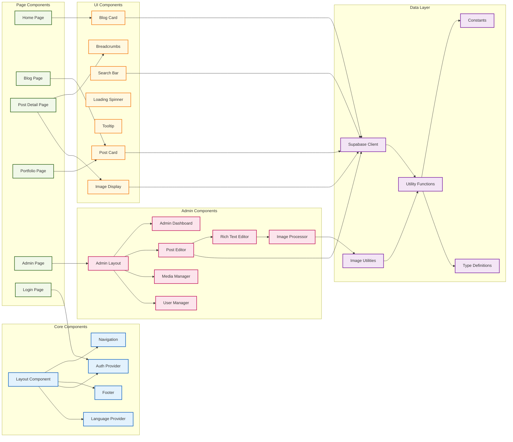
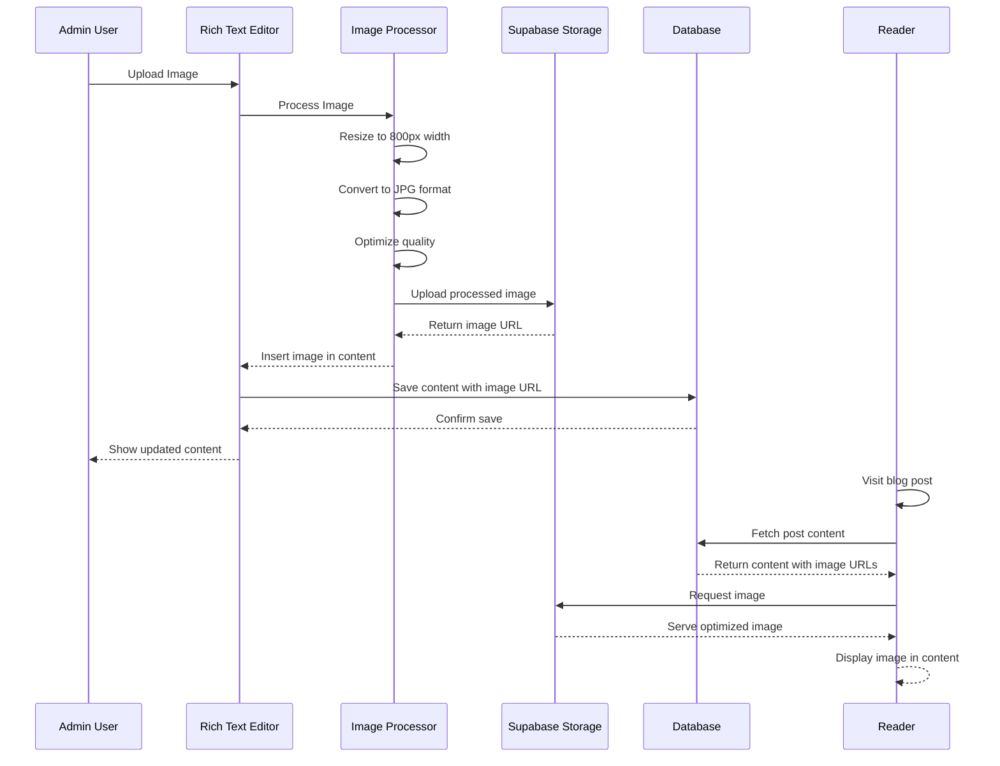
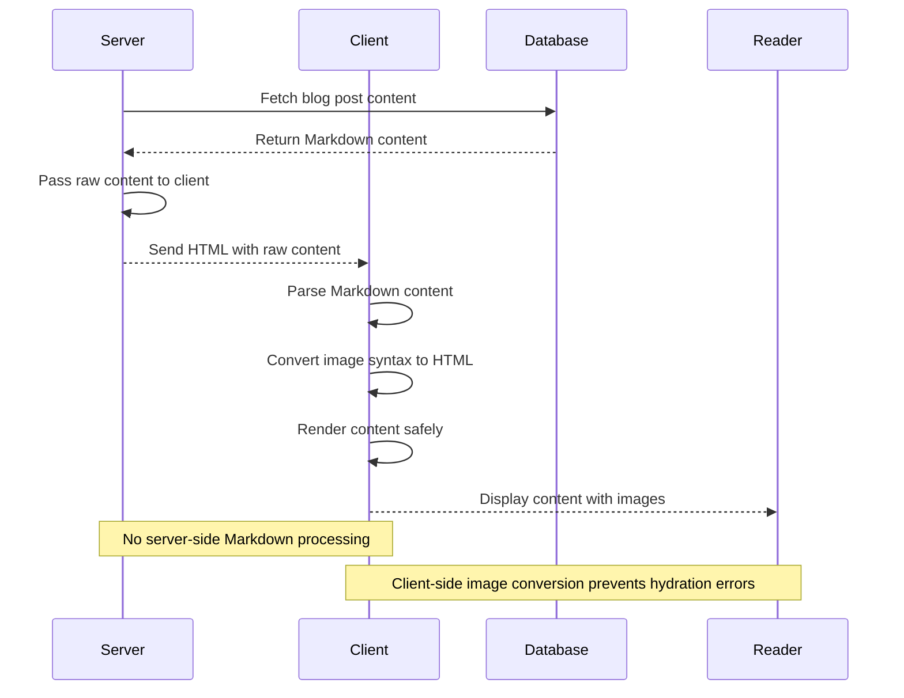
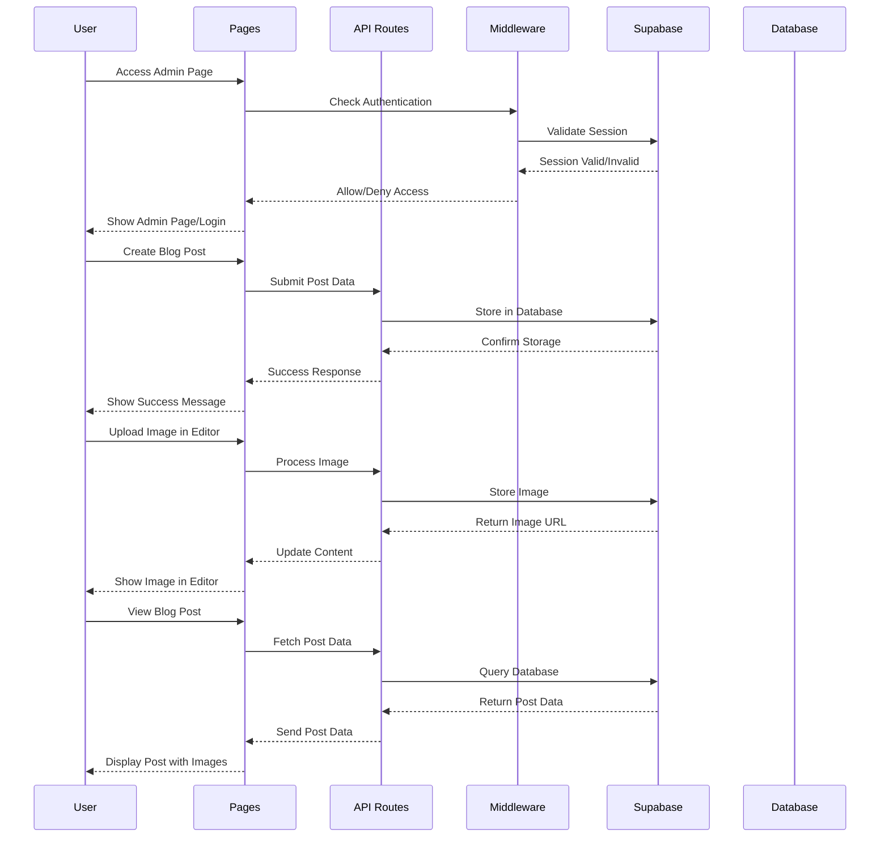

# System Architecture Diagram

## High-Level System Architecture

```mermaid
graph TB
    %% User Layer
    subgraph "Users"
        Admin[Admin User]
        Reader[Reader/Visitor]
        Mobile[Mobile User]
    end

    %% Frontend Layer
    subgraph "Frontend (Next.js 15)"
        Pages[Pages & Components]
        API_Routes[API Routes]
        Middleware[Middleware]
        Auth_Provider[Auth Provider]
        Language_Provider[Language Provider]
        Rich_Text_Editor[Rich Text Editor]
        Image_Processor[Image Processor]
    end

    %% Backend Services
    subgraph "Backend Services (Supabase)"
        Auth[Authentication]
        Database[(PostgreSQL Database)]
        Storage[File Storage]
        RLS[Row Level Security]
        RealTime[Real-time Subscriptions]
    end

    %% External Services
    subgraph "External Services"
        Vercel[Vercel Hosting]
        CDN[Global CDN]
        Analytics[Analytics]
    end

    %% Database Tables
    subgraph "Database Schema"
        Users[Users Table]
        Posts[Blog Posts Table]
        Translations[Translations Table]
        Categories[Categories Table]
        Tags[Tags Table]
        Portfolio[Portfolio Table]
        Views[Page Views Table]
        Media[Media Table]
    end

    %% Connections
    Admin --> Pages
    Reader --> Pages
    Mobile --> Pages

    Pages --> API_Routes
    API_Routes --> Middleware
    Middleware --> Auth_Provider
    Auth_Provider --> Language_Provider

    Rich_Text_Editor --> Image_Processor
    Image_Processor --> Storage

    API_Routes --> Auth
    API_Routes --> Database
    API_Routes --> Storage
    API_Routes --> RealTime

    Auth --> RLS
    Database --> RLS
    Storage --> RLS

    Pages --> Vercel
    Vercel --> CDN
    Vercel --> Analytics

    Database --> Users
    Database --> Posts
    Database --> Translations
    Database --> Categories
    Database --> Tags
    Database --> Portfolio
    Database --> Views
    Database --> Media

    %% Styling
    classDef userClass fill:#e1f5fe,stroke:#01579b,stroke-width:2px
    classDef frontendClass fill:#f3e5f5,stroke:#4a148c,stroke-width:2px
    classDef backendClass fill:#e8f5e8,stroke:#1b5e20,stroke-width:2px
    classDef externalClass fill:#fff3e0,stroke:#e65100,stroke-width:2px
    classDef databaseClass fill:#fce4ec,stroke:#880e4f,stroke-width:2px

    class Admin,Reader,Mobile userClass
    class Pages,API_Routes,Middleware,Auth_Provider,Language_Provider,Rich_Text_Editor,Image_Processor frontendClass
    class Auth,Database,Storage,RLS,RealTime backendClass
    class Vercel,CDN,Analytics externalClass
    class Users,Posts,Translations,Categories,Tags,Portfolio,Views,Media databaseClass
```

## Component Architecture

## Image Processing Flow

## Content Rendering Flow

## Data Flow Architecture

## Updated Architecture Notes

### Image Processing Components
- **Rich Text Editor**: TipTap-based editor with image upload integration
- **Image Processor**: Client-side image processing with Canvas API
- **Image Utilities**: Helper functions for image manipulation and optimization
- **Image Display**: Responsive image rendering component

### Content Rendering Strategy
- **Server**: Passes raw Markdown content to client
- **Client**: Converts Markdown images to HTML using regex
- **Hydration Safety**: Prevents server/client mismatches
- **Performance**: Fast rendering without external libraries

### Storage Architecture
- **Supabase Storage**: Secure file storage with public read access
- **Image Organization**: Structured folder system for different content types
- **Optimization**: Automatic format conversion and compression
- **CDN**: Global content delivery through Vercel

---

*Last updated: January 19, 2025* 