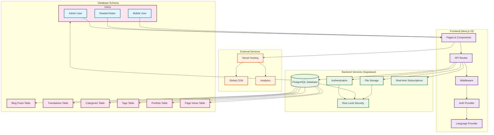
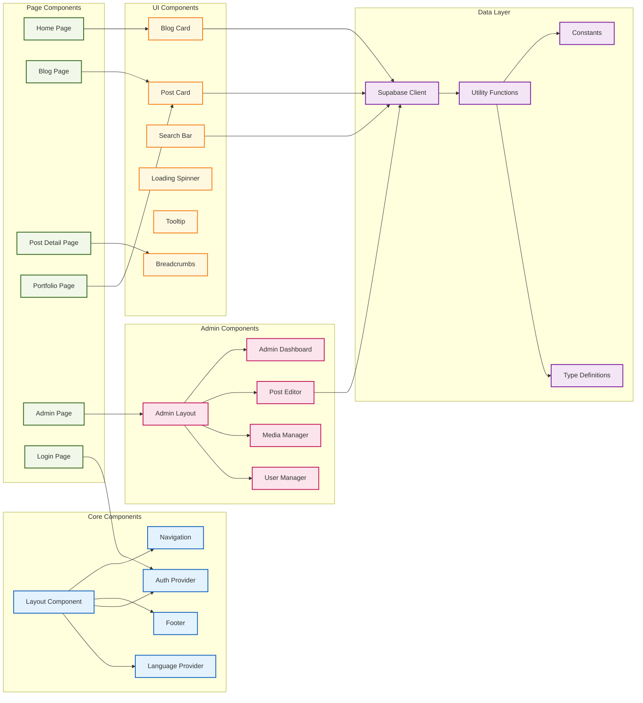
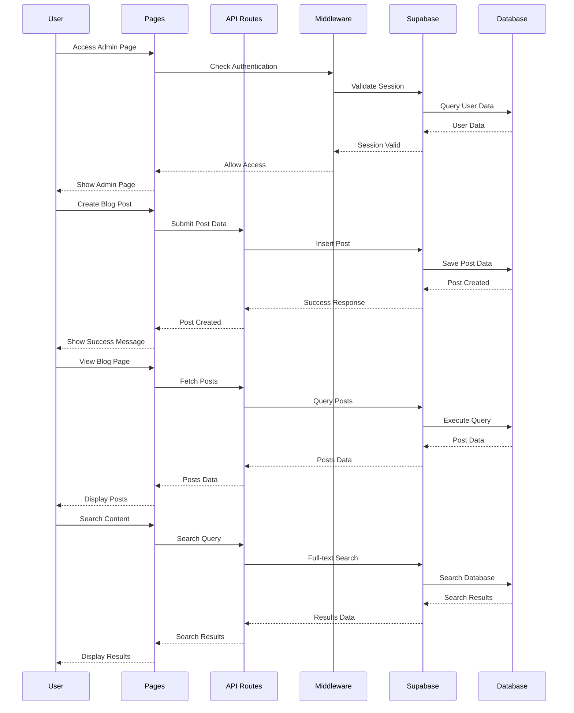

# System Architecture Diagram

## High-Level System Architecture

```mermaid
graph TB
    %% User Layer
    subgraph "Users"
        Admin[Admin User]
        Reader[Reader/Visitor]
        Mobile[Mobile User]
    end

    %% Frontend Layer
    subgraph "Frontend (Next.js 15)"
        Pages[Pages & Components]
        API_Routes[API Routes]
        Middleware[Middleware]
        Auth_Provider[Auth Provider]
        Language_Provider[Language Provider]
    end

    %% Backend Services
    subgraph "Backend Services (Supabase)"
        Auth[Authentication]
        Database[(PostgreSQL Database)]
        Storage[File Storage]
        RLS[Row Level Security]
        RealTime[Real-time Subscriptions]
    end

    %% External Services
    subgraph "External Services"
        Vercel[Vercel Hosting]
        CDN[Global CDN]
        Analytics[Analytics]
    end

    %% Database Tables
    subgraph "Database Schema"
        Users[Users Table]
        Posts[Blog Posts Table]
        Translations[Translations Table]
        Categories[Categories Table]
        Tags[Tags Table]
        Portfolio[Portfolio Table]
        Views[Page Views Table]
    end

    %% Connections
    Admin --> Pages
    Reader --> Pages
    Mobile --> Pages

    Pages --> API_Routes
    API_Routes --> Middleware
    Middleware --> Auth_Provider
    Auth_Provider --> Language_Provider

    API_Routes --> Auth
    API_Routes --> Database
    API_Routes --> Storage
    API_Routes --> RealTime

    Auth --> RLS
    Database --> RLS
    Storage --> RLS

    Pages --> Vercel
    Vercel --> CDN
    Vercel --> Analytics

    Database --> Users
    Database --> Posts
    Database --> Translations
    Database --> Categories
    Database --> Tags
    Database --> Portfolio
    Database --> Views

    %% Styling
    classDef userClass fill:#e1f5fe,stroke:#01579b,stroke-width:2px
    classDef frontendClass fill:#f3e5f5,stroke:#4a148c,stroke-width:2px
    classDef backendClass fill:#e8f5e8,stroke:#1b5e20,stroke-width:2px
    classDef externalClass fill:#fff3e0,stroke:#e65100,stroke-width:2px
    classDef databaseClass fill:#fce4ec,stroke:#880e4f,stroke-width:2px

    class Admin,Reader,Mobile userClass
    class Pages,API_Routes,Middleware,Auth_Provider,Language_Provider frontendClass
    class Auth,Database,Storage,RLS,RealTime backendClass
    class Vercel,CDN,Analytics externalClass
    class Users,Posts,Translations,Categories,Tags,Portfolio,Views databaseClass
```

## Component Architecture

```mermaid
graph LR
    %% Core Components
    subgraph "Core Components"
        Layout[Layout Component]
        Navigation[Navigation]
        Footer[Footer]
        AuthProvider[Auth Provider]
        LanguageProvider[Language Provider]
    end

    %% Page Components
    subgraph "Page Components"
        HomePage[Home Page]
        BlogPage[Blog Page]
        PostPage[Post Detail Page]
        PortfolioPage[Portfolio Page]
        AdminPage[Admin Page]
        LoginPage[Login Page]
    end

    %% UI Components
    subgraph "UI Components"
        BlogCard[Blog Card]
        PostCard[Post Card]
        SearchBar[Search Bar]
        LoadingSpinner[Loading Spinner]
        Tooltip[Tooltip]
        Breadcrumbs[Breadcrumbs]
    end

    %% Admin Components
    subgraph "Admin Components"
        AdminLayout[Admin Layout]
        AdminDashboard[Admin Dashboard]
        PostEditor[Post Editor]
        MediaManager[Media Manager]
        UserManager[User Manager]
    end

    %% Data Layer
    subgraph "Data Layer"
        SupabaseClient[Supabase Client]
        Utils[Utility Functions]
        Constants[Constants]
        Types[Type Definitions]
    end

    %% Connections
    Layout --> Navigation
    Layout --> Footer
    Layout --> AuthProvider
    Layout --> LanguageProvider

    HomePage --> BlogCard
    BlogPage --> PostCard
    PostPage --> Breadcrumbs
    PortfolioPage --> PostCard
    AdminPage --> AdminLayout
    LoginPage --> AuthProvider

    AdminLayout --> AdminDashboard
    AdminLayout --> PostEditor
    AdminLayout --> MediaManager
    AdminLayout --> UserManager

    BlogCard --> SupabaseClient
    PostCard --> SupabaseClient
    SearchBar --> SupabaseClient
    PostEditor --> SupabaseClient

    SupabaseClient --> Utils
    Utils --> Constants
    Utils --> Types

    %% Styling
    classDef coreClass fill:#e3f2fd,stroke:#1565c0,stroke-width:2px
    classDef pageClass fill:#f1f8e9,stroke:#33691e,stroke-width:2px
    classDef uiClass fill:#fff8e1,stroke:#f57f17,stroke-width:2px
    classDef adminClass fill:#fce4ec,stroke:#c2185b,stroke-width:2px
    classDef dataClass fill:#f3e5f5,stroke:#7b1fa2,stroke-width:2px

    class Layout,Navigation,Footer,AuthProvider,LanguageProvider coreClass
    class HomePage,BlogPage,PostPage,PortfolioPage,AdminPage,LoginPage pageClass
    class BlogCard,PostCard,SearchBar,LoadingSpinner,Tooltip,Breadcrumbs uiClass
    class AdminLayout,AdminDashboard,PostEditor,MediaManager,UserManager adminClass
    class SupabaseClient,Utils,Constants,Types dataClass
```

## Data Flow Architecture

```mermaid
sequenceDiagram
    participant U as User
    participant P as Pages
    participant A as API Routes
    participant M as Middleware
    participant S as Supabase
    participant D as Database

    %% Authentication Flow
    U->>P: Access Admin Page
    P->>M: Check Authentication
    M->>S: Validate Session
    S->>D: Query User Data
    D-->>S: User Data
    S-->>M: Session Valid
    M-->>P: Allow Access
    P-->>U: Show Admin Page

    %% Content Creation Flow
    U->>P: Create Blog Post
    P->>A: Submit Post Data
    A->>S: Insert Post
    S->>D: Save Post Data
    D-->>S: Post Created
    S-->>A: Success Response
    A-->>P: Post Created
    P-->>U: Show Success Message

    %% Content Display Flow
    U->>P: View Blog Page
    P->>A: Fetch Posts
    A->>S: Query Posts
    S->>D: Execute Query
    D-->>S: Post Data
    S-->>A: Posts Data
    A-->>P: Posts Data
    P-->>U: Display Posts

    %% Search Flow
    U->>P: Search Content
    P->>A: Search Query
    A->>S: Full-text Search
    S->>D: Search Database
    D-->>S: Search Results
    S-->>A: Results Data
    A-->>P: Search Results
    P-->>U: Display Results
```

## Technology Stack Architecture

```mermaid
graph TB
    %% Frontend Technologies
    subgraph "Frontend Stack"
        NextJS[Next.js 15]
        React[React 18]
        TypeScript[TypeScript]
        TailwindCSS[Tailwind CSS]
        LucideIcons[Lucide Icons]
    end

    %% Backend Technologies
    subgraph "Backend Stack"
        Supabase[Supabase]
        PostgreSQL[PostgreSQL]
        Auth[Supabase Auth]
        Storage[Supabase Storage]
    end

    %% Development Tools
    subgraph "Development Tools"
        ESLint[ESLint]
        Prettier[Prettier]
        Git[Git]
        VSCode[VS Code]
    end

    %% Deployment & Hosting
    subgraph "Deployment & Hosting"
        Vercel[Vercel]
        CDN[Global CDN]
        SSL[SSL Certificates]
        CI_CD[CI/CD Pipeline]
    end

    %% External Services
    subgraph "External Services"
        Analytics[Analytics]
        Monitoring[Monitoring]
        Backup[Backup Services]
    end

    %% Connections
    NextJS --> React
    React --> TypeScript
    NextJS --> TailwindCSS
    NextJS --> LucideIcons

    Supabase --> PostgreSQL
    Supabase --> Auth
    Supabase --> Storage

    NextJS --> Supabase
    TypeScript --> ESLint
    TypeScript --> Prettier

    NextJS --> Vercel
    Vercel --> CDN
    Vercel --> SSL
    Vercel --> CI_CD

    Vercel --> Analytics
    Vercel --> Monitoring
    Supabase --> Backup

    %% Styling
    classDef frontendClass fill:#e8f5e8,stroke:#2e7d32,stroke-width:2px
    classDef backendClass fill:#e3f2fd,stroke:#1565c0,stroke-width:2px
    classDef devClass fill:#fff3e0,stroke:#e65100,stroke-width:2px
    classDef deployClass fill:#fce4ec,stroke:#c2185b,stroke-width:2px
    classDef externalClass fill:#f3e5f5,stroke:#7b1fa2,stroke-width:2px

    class NextJS,React,TypeScript,TailwindCSS,LucideIcons frontendClass
    class Supabase,PostgreSQL,Auth,Storage backendClass
    class ESLint,Prettier,Git,VSCode devClass
    class Vercel,CDN,SSL,CI_CD deployClass
    class Analytics,Monitoring,Backup externalClass
``` 