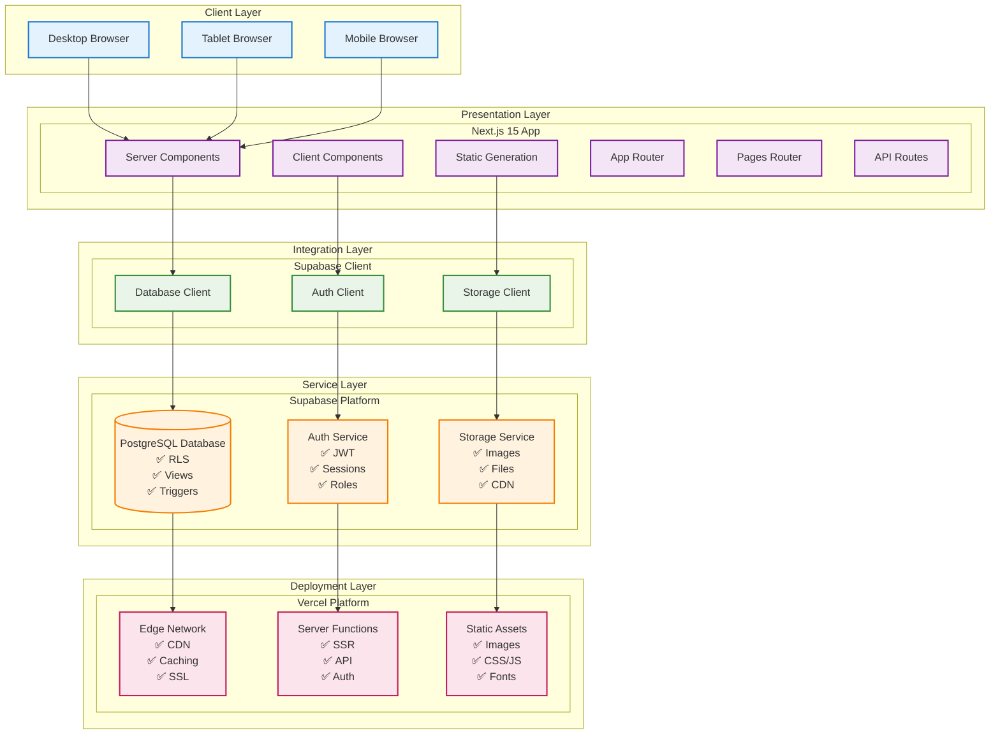
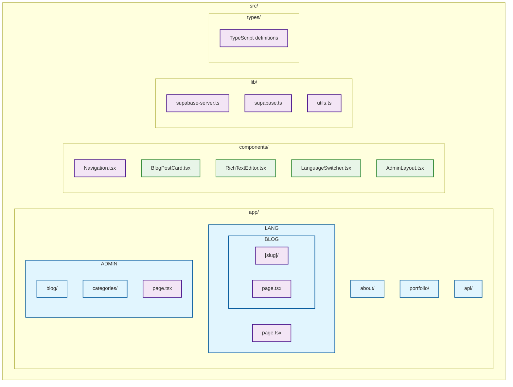
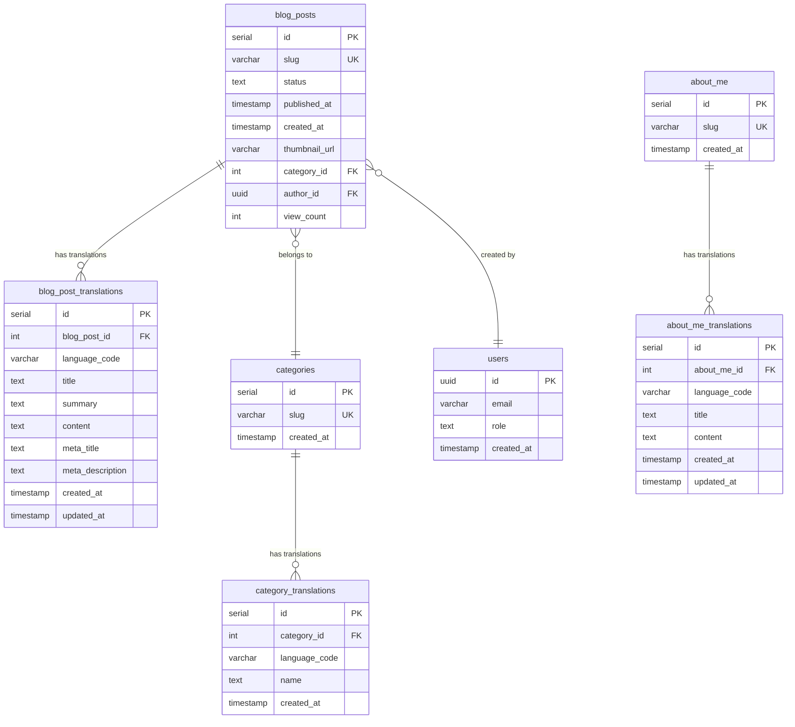
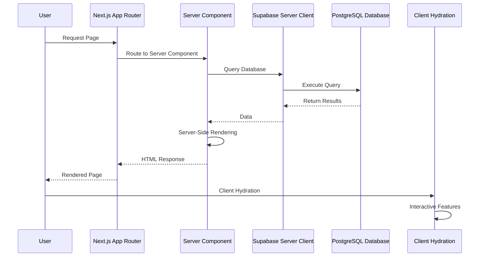
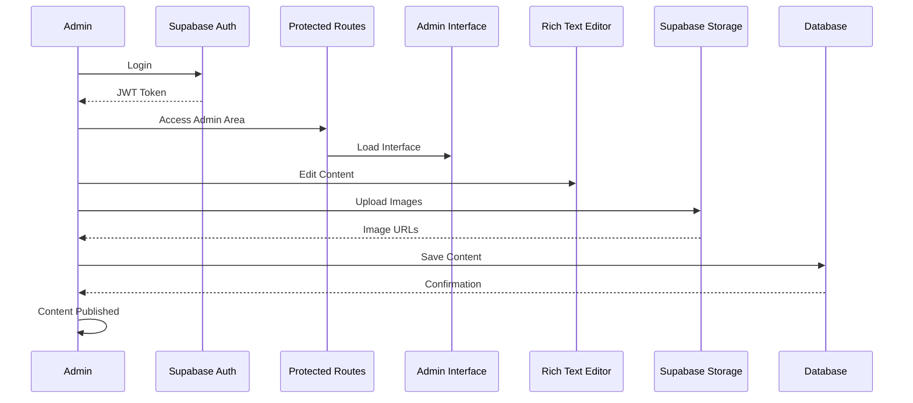
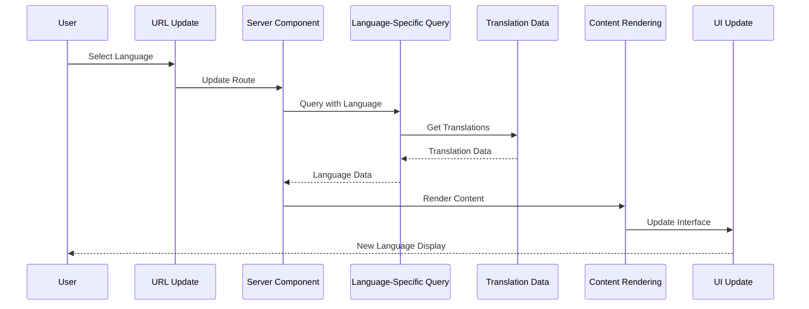

# System Architecture Diagram
## Matt Dinh Blog Platform

**Version**: 2.0  
**Date**: December 2024  
**Status**: Core Features Complete ✅

---

## Architecture Overview

---

## Component Architecture

### Frontend Components (✅ Complete)

### Database Schema (✅ Complete)

---

## Data Flow Architecture

### Content Display Flow (✅ Complete)

### Admin Content Management Flow (✅ Complete)

### Language Switching Flow (✅ Complete)

---

## Technology Stack

### Frontend Technologies (✅ Complete)
- **Next.js 15** - React framework with App Router
- **TypeScript** - Type-safe JavaScript
- **Tailwind CSS** - Utility-first CSS framework
- **React Hook Form** - Form management
- **React Query** - Data fetching and caching

### Backend Technologies (✅ Complete)
- **Supabase** - Backend-as-a-Service
- **PostgreSQL** - Relational database
- **Row Level Security (RLS)** - Data security
- **JWT Authentication** - User authentication
- **Supabase Storage** - File storage

### Deployment & Infrastructure (✅ Complete)
- **Vercel** - Hosting and deployment
- **Edge Network** - Global CDN
- **Serverless Functions** - API endpoints
- **Automatic SSL** - Security certificates
- **Git Integration** - Continuous deployment

### Development Tools (✅ Complete)
- **ESLint** - Code linting
- **Prettier** - Code formatting
- **TypeScript** - Type checking
- **Git** - Version control
- **VS Code** - Development environment

---

## Security Architecture

### Authentication & Authorization (✅ Complete)
- **JWT Tokens** - Secure session management
- **Row Level Security** - Database-level access control
- **Role-based Access** - User permission management
- **Protected Routes** - Client-side route protection
- **Server-side Validation** - API endpoint security

### Data Protection (✅ Complete)
- **HTTPS/SSL** - Encrypted data transmission
- **Input Validation** - XSS and injection prevention
- **CSRF Protection** - Cross-site request forgery prevention
- **Content Security Policy** - XSS mitigation
- **Rate Limiting** - API abuse prevention

### Infrastructure Security (✅ Complete)
- **Vercel Security** - Platform-level protection
- **Supabase Security** - Database and storage security
- **Environment Variables** - Secure configuration management
- **Regular Updates** - Security patch management
- **Backup Strategy** - Data recovery protection

---

## Performance Architecture

### Frontend Performance (✅ Complete)
- **Server-Side Rendering** - Fast initial page loads
- **Static Generation** - Pre-built pages for better performance
- **Image Optimization** - Next.js Image component
- **Code Splitting** - Lazy loading of components
- **Caching Strategy** - Browser and CDN caching

### Backend Performance (✅ Complete)
- **Database Indexing** - Optimized query performance
- **Connection Pooling** - Efficient database connections
- **Query Optimization** - Minimal database round trips
- **Caching Layer** - Redis-like caching (Supabase)
- **CDN Distribution** - Global content delivery

### Monitoring & Analytics (✅ Complete)
- **Vercel Analytics** - Performance monitoring
- **Error Tracking** - Application error monitoring
- **User Analytics** - User behavior tracking
- **Performance Metrics** - Core Web Vitals tracking
- **Uptime Monitoring** - System availability tracking

---

## Scalability Architecture

### Horizontal Scaling (✅ Complete)
- **Serverless Functions** - Automatic scaling
- **Edge Network** - Global distribution
- **Database Scaling** - Supabase managed scaling
- **Storage Scaling** - Automatic storage expansion
- **CDN Scaling** - Global content distribution

### Vertical Scaling (✅ Complete)
- **Database Optimization** - Query and index optimization
- **Code Optimization** - Bundle size and performance optimization
- **Image Optimization** - Compression and format optimization
- **Caching Strategy** - Multi-level caching
- **Resource Management** - Efficient resource utilization

---

## Disaster Recovery

### Backup Strategy (✅ Complete)
- **Database Backups** - Automated daily backups
- **File Backups** - Storage bucket backups
- **Code Backups** - Git repository backups
- **Configuration Backups** - Environment variable backups
- **Recovery Procedures** - Documented recovery processes

### High Availability (✅ Complete)
- **Multi-region Deployment** - Vercel edge network
- **Database Redundancy** - Supabase managed redundancy
- **CDN Distribution** - Global content availability
- **Failover Procedures** - Automatic failover mechanisms
- **Monitoring Alerts** - Proactive issue detection

---

*This system architecture diagram provides a comprehensive overview of the Matt Dinh Blog platform's technical implementation. The architecture is designed for scalability, security, and performance while maintaining simplicity and maintainability.* 