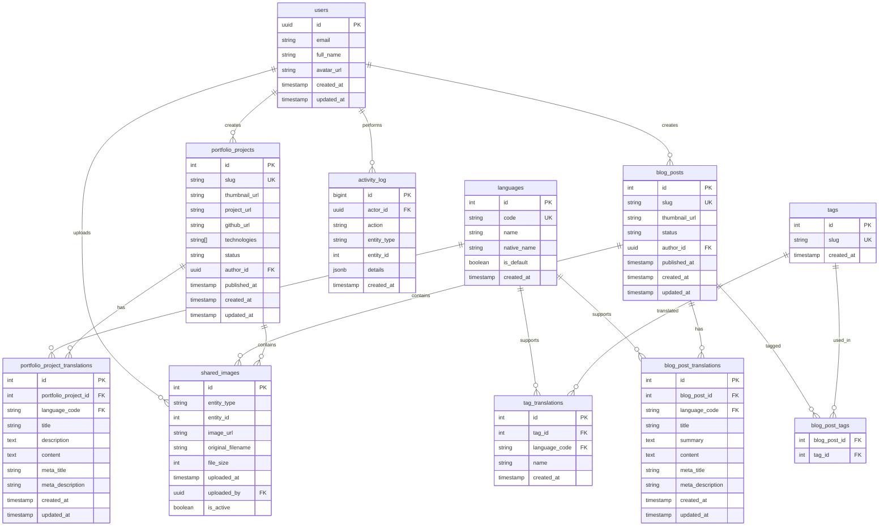

# System Architecture Diagrams
## Matt Dinh Blog Platform

**Version**: 3.0  
**Date**: January 9, 2025  
**Status**: Production Ready ✅

---

## 1. High-Level System Architecture


---

## 2. Database Architecture



---

## 3. Shared Images Management Architecture

```mermaid
graph TB
    subgraph "Client Side"
        A[Rich Text Editor] --> B[Image Upload Component]
        A --> C[Shared Images Library]
        D[Admin Image Management] --> E[Image List Component]
    end
    
    subgraph "API Layer"
        F[/api/shared-images] --> G[GET: Retrieve Images]
        F --> H[POST: Upload Image]
        F --> I[DELETE: Remove Image]
    end
    
    subgraph "Database Layer"
        J[(shared_images table)] --> K[Entity-Scoped Storage]
        L[(blog_posts table)] --> K
        M[(portfolio_projects table)] --> K
    end
    
    subgraph "Storage Layer"
        N[Supabase Storage] --> O[blog-images bucket]
        P[Image Processing] --> O
    end
    
    B --> F
    C --> F
    E --> F
    G --> J
    H --> J
    H --> N
    I --> J
    K --> L
    K --> M
    P --> O
```

---

## 4. Authentication and Authorization Flow


---

## 5. Content Management Flow


---

## 6. Image Processing Pipeline


---

## 7. Internationalization Architecture

```mermaid
graph TB
    subgraph "Client Side"
        A[Language Switcher] --> B[Language Provider]
        B --> C[Content Components]
    end
    
    subgraph "Routing Layer"
        D[/[lang]/blog] --> E[Language Detection]
        D --> F[/[lang]/portfolio]
        D --> G[/[lang]/about]
    end
    
    subgraph "Database Layer"
        H[Translation Tables] --> I[blog_post_translations]
        H --> J[portfolio_project_translations]
        H --> K[tag_translations]
    end
    
    subgraph "Content Layer"
        L[Vietnamese Content] --> H
        M[English Content] --> H
    end
    
    A --> B
    B --> C
    E --> H
    F --> H
    G --> H
```

---

## 8. Production Deployment Architecture


---

## 9. Security Architecture


---

## 10. Performance Optimization Architecture


---

## 11. Monitoring and Logging Architecture


---

## 12. Data Flow Architecture


---

## 13. Component Architecture


---

## 14. API Architecture

```mermaid
graph TB
    subgraph "Public APIs"
        A[/api/increment-view] --> B[View Counter]
        C[/api/shared-images] --> D[Image Management]
    end
    
    subgraph "Admin APIs"
        E[/api/admin/blog] --> F[Blog Management]
        G[/api/admin/portfolio] --> H[Portfolio Management]
        I[/api/admin/categories] --> J[Category Management]
    end
    
    subgraph "Utility APIs"
        K[/api/setup-about-me] --> L[About Me Setup]
        M[/api/setup-portfolio] --> N[Portfolio Setup]
        O[/api/update-image-url] --> P[Image URL Update]
    end
    
    subgraph "Database Layer"
        Q[(PostgreSQL)] --> R[Data Storage]
        S[(Supabase Storage)] --> T[File Storage]
    end
    
    A --> Q
    C --> S
    E --> Q
    G --> Q
    I --> Q
    K --> Q
    M --> Q
    O --> S
```

---

## 15. Deployment Pipeline


---

## Conclusion

The system architecture diagrams provide a comprehensive view of the Matt Dinh Blog Platform's production-ready architecture, including:

- **High-Level System Architecture**: Overall system components and relationships
- **Database Architecture**: Complete database schema with entity relationships
- **Shared Images Management**: Entity-scoped image storage and retrieval system
- **Authentication Flow**: Secure user authentication and authorization
- **Content Management Flow**: Complete content creation and management process
- **Production Deployment**: Live production infrastructure
- **Security Architecture**: Comprehensive security measures
- **Performance Optimization**: System performance and scalability features
- **Monitoring and Logging**: System monitoring and audit capabilities

All architectural components have been successfully implemented and deployed to production, providing a robust, scalable, and secure platform for content management and portfolio showcasing.

---

**Document Approval:**
- **System Architect:** Matt Dinh
- **Technical Lead:** Matt Dinh
- **Infrastructure Lead:** Matt Dinh
- **Date:** January 9, 2025

---

*Last updated: January 9, 2025*

---

**Production Deployment Update (2025-01-09):**
- All architectural components successfully implemented and deployed
- Shared Images Management architecture fully operational
- Production infrastructure and monitoring systems in place
- System ready for ongoing architectural enhancements and maintenance
