# Use Case Diagram
## Matt Dinh Blog Platform

**Version**: 1.0  
**Date**: December 2024  
**Status**: Core Use Cases Complete ✅

**Update (2024-07-19):**
- Admin blog edit and create forms now include robust unsaved changes protection. All navigation (breadcrumbs, nav bar, <a>, <Link>, router) is protected by a confirmation popup if there are unsaved changes, implemented via a reusable hook and Breadcrumbs prop.

---

## Use Case Diagram Overview

The Matt Dinh Blog platform serves multiple user types with different goals and permissions. This diagram shows the relationships between actors and the use cases they can perform.

---

## Use Case Diagram

```mermaid
graph TB
    %% External Actors
    BR[Blog Reader]
    PV[Portfolio Viewer]
    SM[Social Media Platform]
    
    %% Internal Actors
    CC[Content Creator<br/>Admin]
    SA[System Admin]
    DS[Database System]
    
    %% Use Cases - Blog Reader
    subgraph "Blog Reader Use Cases"
        BP[Browse Posts]
        RC[Read Content]
        SP[Search Posts]
        FC[Filter By Category]
        SL[Switch Language]
        SHP[Share Posts]
    end
    
    %% Use Cases - Portfolio Viewer
    subgraph "Portfolio Viewer Use Cases"
        BPR[Browse Projects]
        VD[View Details]
        FT[Filter By Technology]
        CT[Contact Creator]
        DA[Download Assets]
        RP[Rate Projects]
    end
    
    %% Use Cases - Content Creator
    subgraph "Content Creator Use Cases"
        CP[Create Posts]
        EP[Edit Posts]
        DP[Delete Posts]
        PP[Publish Posts]
        UI[Upload Images]
        MC[Manage Categories]
    end
    
    %% Use Cases - System Admin
    subgraph "System Admin Use Cases"
        MU[Manage Users]
        MS[Monitor System]
        BD[Backup Data]
        CS[Configure Settings]
        SPO[Security Policies]
        AR[Analytics Reports]
    end
    
    %% Use Cases - Database System
    subgraph "Database System Use Cases"
        SD[Store Data]
        RD[Retrieve Data]
        UD[Update Data]
        DD[Delete Data]
        IC[Index Content]
        BKD[Backup Data]
    end
    
    %% Relationships - Blog Reader
    BR --> BP
    BR --> RC
    BR --> SP
    BR --> FC
    BR --> SL
    BR --> SHP
    
    %% Relationships - Portfolio Viewer
    PV --> BPR
    PV --> VD
    PV --> FT
    PV --> CT
    PV --> DA
    PV --> RP
    
    %% Relationships - Content Creator
    CC --> CP
    CC --> EP
    CC --> DP
    CC --> PP
    CC --> UI
    CC --> MC
    
    %% Relationships - System Admin
    SA --> MU
    SA --> MS
    SA --> BD
    SA --> CS
    SA --> SPO
    SA --> AR
    
    %% Relationships - Database System
    DS --> SD
    DS --> RD
    DS --> UD
    DS --> DD
    DS --> IC
    DS --> BKD
    
    %% External Relationships
    SM --> SHP
    SM --> RP
    
    %% Styling
    classDef actor fill:#e1f5fe,stroke:#01579b,stroke-width:2px
    classDef useCase fill:#f3e5f5,stroke:#4a148c,stroke-width:2px
    classDef external fill:#fff3e0,stroke:#e65100,stroke-width:2px
    
    class BR,PV,CC,SA,DS actor
    class BP,RC,SP,FC,SL,SHP,BPR,VD,FT,CT,DA,RP,CP,EP,DP,PP,UI,MC,MU,MS,BD,CS,SPO,AR,SD,RD,UD,DD,IC,BKD useCase
    class SM external
```

---

## Detailed Use Case Descriptions

### 1. Blog Reader Use Cases (✅ Complete)

#### 1.1 Browse Posts
- **Actor**: Blog Reader
- **Description**: User can browse through all published blog posts
- **Preconditions**: User has access to the blog
- **Main Flow**:
  1. User visits blog page
  2. System displays list of published posts
  3. User can navigate through posts
  4. User can see post thumbnails and summaries
- **Postconditions**: User can see all available blog posts

#### 1.2 Read Content
- **Actor**: Blog Reader
- **Description**: User can read full blog post content
- **Preconditions**: User has selected a blog post
- **Main Flow**:
  1. User clicks on a blog post
  2. System displays full post content
  3. User can read the complete article
  4. User can see images and formatting
- **Postconditions**: User has read the complete blog post

#### 1.3 Search Posts
- **Actor**: Blog Reader
- **Description**: User can search for specific content
- **Preconditions**: User is on blog page
- **Main Flow**:
  1. User enters search terms
  2. System searches through post titles and content
  3. System displays relevant results
  4. User can click on search results
- **Postconditions**: User finds relevant content

#### 1.4 Filter By Category
- **Actor**: Blog Reader
- **Description**: User can filter posts by category
- **Preconditions**: User is on blog page
- **Main Flow**:
  1. User selects a category
  2. System filters posts by selected category
  3. System displays filtered results
  4. User can browse category-specific posts
- **Postconditions**: User sees posts from selected category

#### 1.5 Switch Language
- **Actor**: Blog Reader
- **Description**: User can switch between Vietnamese and English
- **Preconditions**: User is viewing content
- **Main Flow**:
  1. User clicks language switcher
  2. System changes interface language
  3. System loads content in selected language
  4. User sees content in preferred language
- **Postconditions**: Content is displayed in selected language

#### 1.6 Share Posts
- **Actor**: Blog Reader
- **Description**: User can share posts on social media
- **Preconditions**: User is viewing a blog post
- **Main Flow**:
  1. User clicks share button
  2. System provides sharing options
  3. User selects social platform
  4. System generates share link
- **Postconditions**: Post is shared on selected platform

### 2. Portfolio Viewer Use Cases (🔄 In Progress)

#### 2.1 Browse Projects
- **Actor**: Portfolio Viewer
- **Description**: User can browse portfolio projects
- **Preconditions**: User has access to portfolio
- **Main Flow**:
  1. User visits portfolio page
  2. System displays list of projects
  3. User can navigate through projects
  4. User can see project thumbnails
- **Postconditions**: User can see all available projects

#### 2.2 View Details
- **Actor**: Portfolio Viewer
- **Description**: User can view detailed project information
- **Preconditions**: User has selected a project
- **Main Flow**:
  1. User clicks on a project
  2. System displays project details
  3. User can see project description
  4. User can view project images
- **Postconditions**: User has viewed complete project details

#### 2.3 Filter By Technology
- **Actor**: Portfolio Viewer
- **Description**: User can filter projects by technology
- **Preconditions**: User is on portfolio page
- **Main Flow**:
  1. User selects a technology
  2. System filters projects by technology
  3. System displays filtered results
  4. User can browse technology-specific projects
- **Postconditions**: User sees projects using selected technology

#### 2.4 Contact Creator
- **Actor**: Portfolio Viewer
- **Description**: User can contact the portfolio creator
- **Preconditions**: User is viewing a project
- **Main Flow**:
  1. User clicks contact button
  2. System provides contact information
  3. User can send message or email
  4. System records contact attempt
- **Postconditions**: User has contacted the creator

#### 2.5 Download Assets
- **Actor**: Portfolio Viewer
- **Description**: User can download project assets
- **Preconditions**: User is viewing a project
- **Main Flow**:
  1. User clicks download button
  2. System provides download options
  3. User selects files to download
  4. System initiates download
- **Postconditions**: User has downloaded project assets

#### 2.6 Rate Projects
- **Actor**: Portfolio Viewer
- **Description**: User can rate and review projects
- **Preconditions**: User is viewing a project
- **Main Flow**:
  1. User clicks rate button
  2. System displays rating interface
  3. User provides rating and review
  4. System saves rating
- **Postconditions**: Project has been rated

### 3. Content Creator Use Cases (✅ Complete)

#### 3.1 Create Posts
- **Actor**: Content Creator
- **Description**: Admin can create new blog posts
- **Preconditions**: Admin is logged in
- **Main Flow**:
  1. Admin navigates to create post page
  2. Admin fills in post details
  3. Admin adds content and images
  4. Admin saves draft or publishes
- **Postconditions**: New post is created

#### 3.2 Edit Posts
- **Actor**: Content Creator
- **Description**: Admin can edit existing posts
- **Preconditions**: Admin is logged in and post exists
- **Main Flow**:
  1. Admin selects post to edit
  2. Admin modifies content
  3. Admin updates images or metadata
  4. Admin saves changes
- **Postconditions**: Post is updated

#### 3.3 Delete Posts
- **Actor**: Content Creator
- **Description**: Admin can delete posts
- **Preconditions**: Admin is logged in and post exists
- **Main Flow**:
  1. Admin selects post to delete
  2. Admin confirms deletion
  3. System removes post from database
  4. System updates related data
- **Postconditions**: Post is deleted

#### 3.4 Publish Posts
- **Actor**: Content Creator
- **Description**: Admin can publish draft posts
- **Preconditions**: Admin is logged in and post is in draft
- **Main Flow**:
  1. Admin selects draft post
  2. Admin reviews content
  3. Admin clicks publish button
  4. System publishes post
- **Postconditions**: Post is published and visible

#### 3.5 Upload Images
- **Actor**: Content Creator
- **Description**: Admin can upload images for posts
- **Preconditions**: Admin is logged in
- **Main Flow**:
  1. Admin selects upload option
  2. Admin chooses image files
  3. System processes and stores images
  4. System provides image URLs
- **Postconditions**: Images are available for use

#### 3.6 Manage Categories
- **Actor**: Content Creator
- **Description**: Admin can manage blog categories
- **Preconditions**: Admin is logged in
- **Main Flow**:
  1. Admin navigates to categories page
  2. Admin creates, edits, or deletes categories
  3. Admin assigns posts to categories
  4. System updates category structure
- **Postconditions**: Categories are managed

### 4. System Admin Use Cases (✅ Complete)

#### 4.1 Manage Users
- **Actor**: System Admin
- **Description**: Admin can manage user accounts
- **Preconditions**: Admin has admin privileges
- **Main Flow**:
  1. Admin accesses user management
  2. Admin views user list
  3. Admin modifies user permissions
  4. Admin can delete users
- **Postconditions**: User accounts are managed

#### 4.2 Monitor System
- **Actor**: System Admin
- **Description**: Admin can monitor system performance
- **Preconditions**: Admin has admin privileges
- **Main Flow**:
  1. Admin accesses monitoring dashboard
  2. Admin views system metrics
  3. Admin checks error logs
  4. Admin identifies issues
- **Postconditions**: System is monitored

#### 4.3 Backup Data
- **Actor**: System Admin
- **Description**: Admin can backup system data
- **Preconditions**: Admin has admin privileges
- **Main Flow**:
  1. Admin initiates backup process
  2. System creates backup files
  3. System stores backup securely
  4. Admin receives backup confirmation
- **Postconditions**: Data is backed up

#### 4.4 Configure Settings
- **Actor**: System Admin
- **Description**: Admin can configure system settings
- **Preconditions**: Admin has admin privileges
- **Main Flow**:
  1. Admin accesses settings page
  2. Admin modifies configuration
  3. Admin saves changes
  4. System applies new settings
- **Postconditions**: Settings are updated

#### 4.5 Security Policies
- **Actor**: System Admin
- **Description**: Admin can manage security policies
- **Preconditions**: Admin has admin privileges
- **Main Flow**:
  1. Admin accesses security settings
  2. Admin configures policies
  3. Admin sets access controls
  4. System enforces policies
- **Postconditions**: Security policies are active

#### 4.6 Analytics Reports
- **Actor**: System Admin
- **Description**: Admin can view analytics reports
- **Preconditions**: Admin has admin privileges
- **Main Flow**:
  1. Admin accesses analytics dashboard
  2. Admin views usage statistics
  3. Admin generates reports
  4. Admin exports data
- **Postconditions**: Analytics are available

### 5. Database System Use Cases (✅ Complete)

#### 5.1 Store Data
- **Actor**: Database System
- **Description**: System stores all application data
- **Preconditions**: Data is provided by application
- **Main Flow**:
  1. Application sends data
  2. System validates data
  3. System stores data securely
  4. System confirms storage
- **Postconditions**: Data is stored

#### 5.2 Retrieve Data
- **Actor**: Database System
- **Description**: System retrieves data for application
- **Preconditions**: Data exists in database
- **Main Flow**:
  1. Application requests data
  2. System queries database
  3. System returns results
  4. Application receives data
- **Postconditions**: Data is retrieved

#### 5.3 Update Data
- **Actor**: Database System
- **Description**: System updates existing data
- **Preconditions**: Data exists in database
- **Main Flow**:
  1. Application sends update request
  2. System validates changes
  3. System updates data
  4. System confirms update
- **Postconditions**: Data is updated

#### 5.4 Delete Data
- **Actor**: Database System
- **Description**: System deletes data from database
- **Preconditions**: Data exists in database
- **Main Flow**:
  1. Application sends delete request
  2. System validates request
  3. System removes data
  4. System confirms deletion
- **Postconditions**: Data is deleted

#### 5.5 Index Content
- **Actor**: Database System
- **Description**: System indexes content for search
- **Preconditions**: Content exists in database
- **Main Flow**:
  1. System analyzes content
  2. System creates search indexes
  3. System optimizes queries
  4. System maintains indexes
- **Postconditions**: Content is indexed

#### 5.6 Backup Data
- **Actor**: Database System
- **Description**: System creates data backups
- **Preconditions**: Data exists in database
- **Main Flow**:
  1. System initiates backup
  2. System copies data
  3. System compresses backup
  4. System stores backup
- **Postconditions**: Backup is created

---

## Use Case Priority Matrix

| Use Case | Priority | Status | Implementation |
|----------|----------|--------|----------------|
| Browse Posts | High | ✅ Complete | Next.js + Supabase |
| Read Content | High | ✅ Complete | Next.js + Supabase |
| Search Posts | Medium | ✅ Complete | Next.js + Supabase |
| Filter By Category | Medium | ✅ Complete | Next.js + Supabase |
| Switch Language | High | ✅ Complete | Next.js i18n |
| Share Posts | Low | ✅ Complete | Social sharing APIs |
| Create Posts | High | ✅ Complete | Admin interface |
| Edit Posts | High | ✅ Complete | Admin interface |
| Delete Posts | Medium | ✅ Complete | Admin interface |
| Publish Posts | High | ✅ Complete | Admin interface |
| Upload Images | Medium | ✅ Complete | Supabase Storage |
| Manage Categories | Medium | ✅ Complete | Admin interface |
| Browse Projects | Medium | 🔄 In Progress | Portfolio module |
| View Details | Medium | 🔄 In Progress | Portfolio module |
| Filter By Technology | Low | 🔄 In Progress | Portfolio module |
| Contact Creator | Low | 🔄 In Progress | Contact form |
| Download Assets | Low | 🔄 In Progress | File download |
| Rate Projects | Low | 🔄 In Progress | Rating system |

---

## Use Case Dependencies

### Critical Dependencies
- **Authentication System** → All admin use cases
- **Database System** → All data-related use cases
- **File Storage** → Upload Images, Download Assets
- **Search Engine** → Search Posts, Filter operations

### Optional Dependencies
- **Social Media APIs** → Share Posts
- **Email System** → Contact Creator
- **Analytics System** → Analytics Reports
- **Backup System** → Backup Data

---

## Use Case Validation

### Completed Use Cases ✅
- All Blog Reader use cases are fully implemented
- All Content Creator use cases are fully implemented
- All System Admin use cases are fully implemented
- All Database System use cases are fully implemented

### In Progress Use Cases 🔄
- Portfolio Viewer use cases are partially implemented
- Some features need UI/UX improvements
- Contact and rating systems need backend integration

### Future Enhancements 🚀
- Advanced search with filters
- Social media integration
- Analytics dashboard
- Mobile app development
- API for third-party integrations

---

## Use Case Metrics

### Performance Metrics
- **Page Load Time**: < 2 seconds
- **Search Response**: < 1 second
- **Image Upload**: < 5 seconds
- **Database Queries**: < 100ms

### User Experience Metrics
- **User Engagement**: Tracked via analytics
- **Content Consumption**: Measured by read time
- **Social Sharing**: Monitored via share buttons
- **User Feedback**: Collected via contact forms

### System Reliability Metrics
- **Uptime**: 99.9% target
- **Error Rate**: < 0.1%
- **Backup Frequency**: Daily
- **Security Audits**: Monthly

---

*This use case diagram provides a comprehensive overview of the Matt Dinh Blog platform's functionality and user interactions. All core use cases are implemented and the system is ready for production use.* 