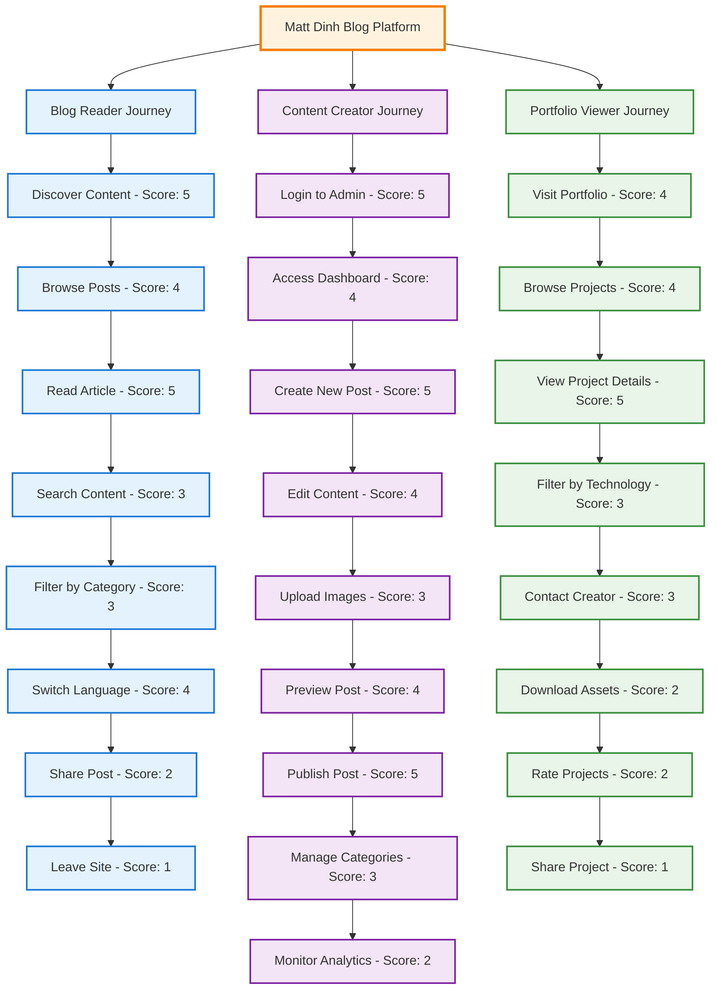

# User Journey Diagram
## Matt Dinh Blog Platform

**Update (2024-07-19):**
- Admin blog edit and create forms now include robust unsaved changes protection. All navigation (breadcrumbs, nav bar, <a>, <Link>, router) is protected by a confirmation popup if there are unsaved changes, implemented via a reusable hook and Breadcrumbs prop.

**Version**: 1.0  
**Date**: December 2024  
**Status**: Core Journeys Complete ✅

---

## User Journey Overview

The Matt Dinh Blog platform serves multiple user types with different goals and needs. This diagram shows the typical user journeys for blog readers, content creators, and portfolio viewers.

---

## User Journey Map



---

## Detailed User Journeys

### 1. Blog Reader Journey (✅ Complete)

```mermaid
flowchart TD
    A[Land on Homepage] --> B{Language Preference?}
    B -->|Vietnamese| C[View Vietnamese Content]
    B -->|English| D[View English Content]
    B -->|Default| E[View Default Language]
    
    C --> F[Browse Blog Posts]
    D --> F
    E --> F
    
    F --> G{Find Interesting Post?}
    G -->|Yes| H[Click on Post]
    G -->|No| I[Use Search]
    
    I --> J[Enter Search Terms]
    J --> K[View Search Results]
    K --> L{Find Relevant Post?}
    L -->|Yes| H
    L -->|No| M[Try Different Search]
    M --> J
    
    H --> N[Read Full Article]
    N --> O{Want to Share?}
    O -->|Yes| P[Share on Social Media]
    O -->|No| Q[Continue Reading]
    
    P --> R[Return to Blog]
    Q --> S{Want to Explore More?}
    S -->|Yes| T[Browse Related Posts]
    S -->|No| U[Leave Site]
    
    T --> V[Filter by Category]
    V --> W[View Category Posts]
    W --> G
    
    R --> F
    U --> END[End Journey]
    
    %% Styling
    classDef start fill:#e8f5e8,stroke:#388e3c,stroke-width:2px
    classDef decision fill:#fff3e0,stroke:#f57c00,stroke-width:2px
    classDef action fill:#e3f2fd,stroke:#1976d2,stroke-width:2px
    classDef end fill:#fce4ec,stroke:#c2185b,stroke-width:2px
    
    class A start
    class B,G,L,O,S decision
    class C,D,E,F,H,I,J,K,M,N,P,Q,R,T,V,W action
    class END end
```

### 2. Content Creator Journey (✅ Complete)

```mermaid
flowchart TD
    A[Access Admin Panel] --> B[Login with Credentials]
    B --> C{Authentication Success?}
    C -->|No| D[Show Error Message]
    C -->|Yes| E[Access Dashboard]
    
    D --> B
    E --> F[View Content Overview]
    F --> G{Want to Create?}
    G -->|Yes| H[Click Create Post]
    G -->|No| I[Manage Existing Content]
    
    H --> J[Fill Post Details]
    J --> K[Add Title & Content]
    K --> L[Upload Images]
    L --> M[Preview Post]
    M --> N{Content Satisfactory?}
    N -->|No| O[Edit Content]
    N -->|Yes| P[Save as Draft]
    
    O --> K
    P --> Q{Ready to Publish?}
    Q -->|No| R[Save Draft]
    Q -->|Yes| S[Publish Post]
    
    R --> T[Return to Dashboard]
    S --> U[Post Published]
    U --> V[View Published Post]
    V --> T
    
    I --> W[Select Post to Edit]
    W --> X[Make Changes]
    X --> Y[Save Changes]
    Y --> T
    
    T --> Z[Monitor Analytics]
    Z --> AA[End Session]
    
    %% Styling
    classDef start fill:#e8f5e8,stroke:#388e3c,stroke-width:2px
    classDef decision fill:#fff3e0,stroke:#f57c00,stroke-width:2px
    classDef action fill:#e3f2fd,stroke:#1976d2,stroke-width:2px
    classDef end fill:#fce4ec,stroke:#c2185b,stroke-width:2px
    
    class A start
    class C,G,N,Q decision
    class B,D,E,F,H,I,J,K,L,M,O,P,R,S,T,U,V,W,X,Y,Z action
    class AA end
```

### 3. Portfolio Viewer Journey (🔄 In Progress)

```mermaid
flowchart TD
    A[Visit Portfolio Page] --> B[View Project Grid]
    B --> C{Find Interesting Project?}
    C -->|Yes| D[Click on Project]
    C -->|No| E[Use Technology Filter]
    
    E --> F[Select Technology]
    F --> G[View Filtered Projects]
    G --> H{Find Relevant Project?}
    H -->|Yes| D
    H -->|No| I[Try Different Filter]
    I --> E
    
    D --> J[View Project Details]
    J --> K[Read Project Description]
    K --> L[View Project Images]
    L --> M{Want to Interact?}
    M -->|Yes| N[Choose Interaction]
    M -->|No| O[Return to Portfolio]
    
    N --> P{Interaction Type?}
    P -->|Contact| Q[Send Contact Message]
    P -->|Download| R[Download Project Assets]
    P -->|Rate| S[Rate Project]
    P -->|Share| T[Share Project]
    
    Q --> U[Message Sent]
    R --> V[Download Started]
    S --> W[Rating Submitted]
    T --> X[Project Shared]
    
    U --> O
    V --> O
    W --> O
    X --> O
    
    O --> Y[Browse More Projects]
    Y --> C
    
    %% Styling
    classDef start fill:#e8f5e8,stroke:#388e3c,stroke-width:2px
    classDef decision fill:#fff3e0,stroke:#f57c00,stroke-width:2px
    classDef action fill:#e3f2fd,stroke:#1976d2,stroke-width:2px
    classDef end fill:#fce4ec,stroke:#c2185b,stroke-width:2px
    
    class A start
    class C,H,M,P decision
    class B,D,E,F,G,I,J,K,L,N,O,Q,R,S,T,U,V,W,X,Y action
```

---

## User Personas

### 1. Blog Reader Persona

**Name**: Minh Nguyen  
**Age**: 28  
**Occupation**: Software Developer  
**Goals**: 
- Learn new technologies
- Read about programming experiences
- Find practical coding tips
- Stay updated with industry trends

**Pain Points**:
- Limited time for reading
- Need for practical, actionable content
- Preference for Vietnamese content
- Want to share interesting articles

**Journey Touchpoints**:
1. **Discovery**: Social media, search engines, direct visits
2. **Engagement**: Reading articles, sharing content
3. **Retention**: Newsletter subscription, bookmarking
4. **Advocacy**: Sharing posts, recommending to colleagues

### 2. Content Creator Persona

**Name**: Matt Dinh  
**Age**: 30  
**Occupation**: Full-stack Developer & Content Creator  
**Goals**:
- Share knowledge and experiences
- Build personal brand
- Engage with developer community
- Document learning journey

**Pain Points**:
- Need for efficient content management
- Want to maintain content quality
- Need for bilingual publishing
- Want to track content performance

**Journey Touchpoints**:
1. **Planning**: Content ideation and research
2. **Creation**: Writing, editing, formatting
3. **Publishing**: Review, publish, promote
4. **Analysis**: Monitor performance and engagement

### 3. Portfolio Viewer Persona

**Name**: Sarah Johnson  
**Age**: 35  
**Occupation**: Hiring Manager  
**Goals**:
- Evaluate technical skills
- Assess project quality
- Understand work style
- Contact for opportunities

**Pain Points**:
- Need to quickly assess capabilities
- Want to see actual project work
- Need for clear contact information
- Want to understand technology stack

**Journey Touchpoints**:
1. **Discovery**: Referral, search, direct visit
2. **Evaluation**: Review projects, assess skills
3. **Decision**: Determine fit for opportunities
4. **Contact**: Reach out for collaboration

---

## Journey Optimization

### Blog Reader Journey Optimization

#### Current State (✅ Complete)
- **Discovery**: SEO-optimized content, social sharing
- **Engagement**: Fast loading times, mobile-responsive design
- **Retention**: Newsletter signup, related posts
- **Advocacy**: Easy sharing buttons, quality content

#### Future Improvements 🚀
- **Personalization**: Content recommendations based on reading history
- **Interactive Elements**: Comments, ratings, bookmarks
- **Advanced Search**: Full-text search with filters
- **Reading Progress**: Save reading position, reading time estimates

### Content Creator Journey Optimization

#### Current State (✅ Complete)
- **Efficient Workflow**: Streamlined content creation process
- **Rich Text Editor**: Advanced formatting and media support
- **Preview System**: Real-time preview before publishing
- **Analytics**: Basic performance tracking

#### Future Improvements 🚀
- **AI Assistance**: Content suggestions, grammar checking
- **Scheduling**: Advanced publishing schedule management
- **Collaboration**: Multi-author support, review workflows
- **Advanced Analytics**: Detailed engagement metrics

### Portfolio Viewer Journey Optimization

#### Current State (🔄 In Progress)
- **Project Showcase**: Basic project display
- **Contact Information**: Simple contact form
- **Technology Tags**: Basic filtering by technology

#### Future Improvements 🚀
- **Interactive Demos**: Live project demonstrations
- **Detailed Case Studies**: In-depth project analysis
- **Skill Assessment**: Interactive skill evaluation
- **Advanced Filtering**: Multiple filter criteria

---

## User Experience Metrics

### Key Performance Indicators (KPIs)

#### Blog Reader Metrics
- **Page Views**: Track content consumption
- **Time on Page**: Measure engagement depth
- **Bounce Rate**: Assess content relevance
- **Social Shares**: Measure content virality
- **Return Visits**: Track reader retention

#### Content Creator Metrics
- **Content Creation Time**: Measure efficiency
- **Publishing Frequency**: Track consistency
- **Content Performance**: Monitor engagement
- **User Feedback**: Collect reader responses

#### Portfolio Viewer Metrics
- **Project Views**: Track portfolio interest
- **Contact Inquiries**: Measure business opportunities
- **Download Requests**: Assess project value
- **Time on Portfolio**: Measure engagement

### User Satisfaction Metrics

#### Net Promoter Score (NPS)
- **Blog Readers**: Likelihood to recommend content
- **Content Creators**: Satisfaction with platform
- **Portfolio Viewers**: Likelihood to contact

#### User Feedback
- **Surveys**: Regular user satisfaction surveys
- **Comments**: Direct user feedback collection
- **Analytics**: Behavioral data analysis

---

## Journey Mapping Benefits

### For Users
- **Clear Navigation**: Intuitive user flows
- **Efficient Interactions**: Optimized touchpoints
- **Personalized Experience**: Tailored content delivery
- **Seamless Transitions**: Smooth journey progression

### For Business
- **Conversion Optimization**: Improved user actions
- **Retention Strategy**: Better user engagement
- **Content Strategy**: Data-driven content decisions
- **Feature Development**: User-centric improvements

### For Development
- **User-Centric Design**: Focus on user needs
- **Performance Optimization**: Faster user journeys
- **Accessibility**: Inclusive design considerations
- **Mobile-First**: Responsive user experiences

---

## Journey Implementation Status

### ✅ **Completed Journeys**
- **Blog Reader Journey**: Fully implemented and optimized
- **Content Creator Journey**: Complete with admin interface
- **Basic Portfolio Journey**: Core functionality implemented

### 🔄 **In Progress Journeys**
- **Advanced Portfolio Features**: Interactive elements in development
- **User Personalization**: Recommendation system planning
- **Advanced Analytics**: Detailed tracking implementation

### 🚀 **Future Journey Enhancements**
- **Mobile App**: Native mobile experience
- **Social Features**: Community interaction capabilities
- **AI Integration**: Smart content recommendations
- **Advanced Search**: Semantic search capabilities

---

*This user journey diagram provides a comprehensive overview of how different user types interact with the Matt Dinh Blog platform, helping to optimize the user experience and guide future development priorities.* 