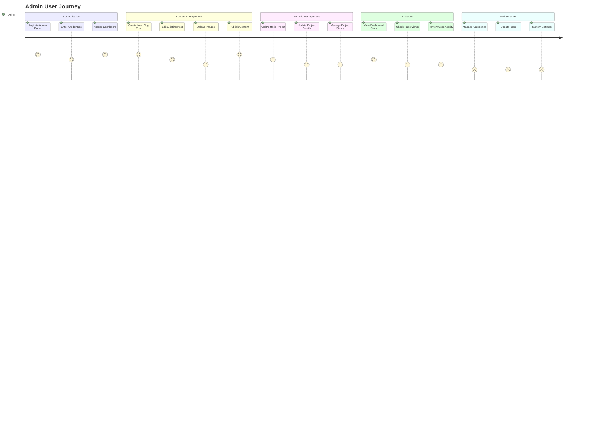
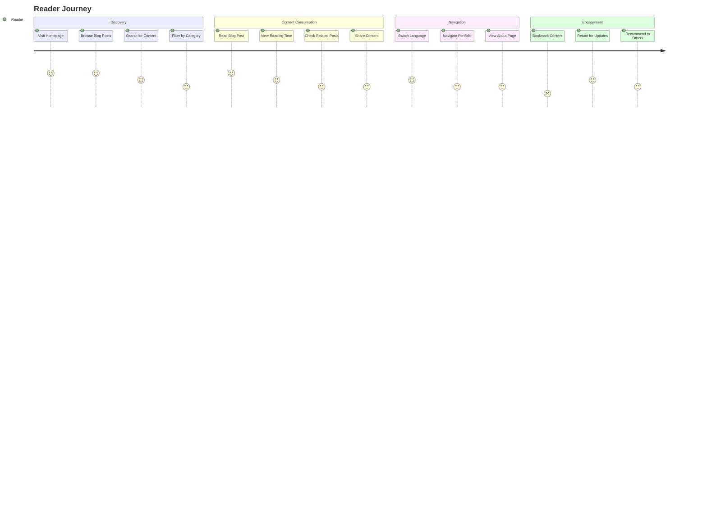
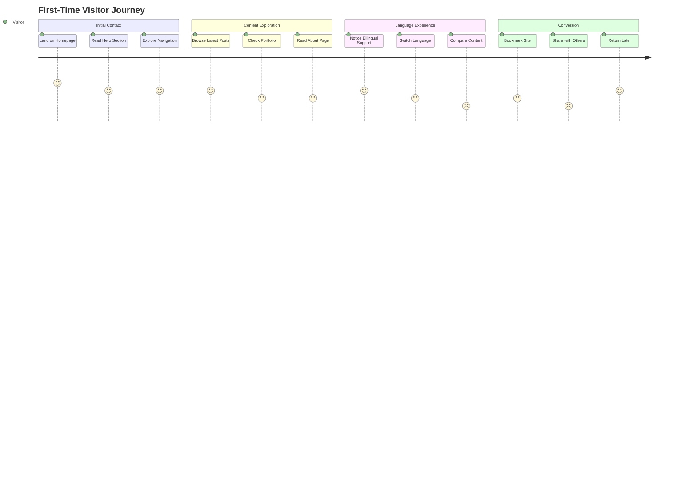
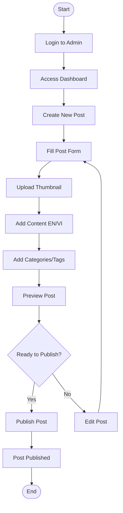
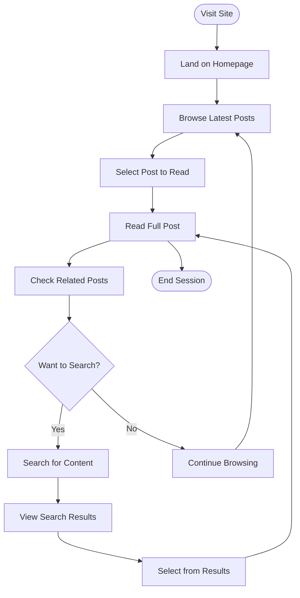
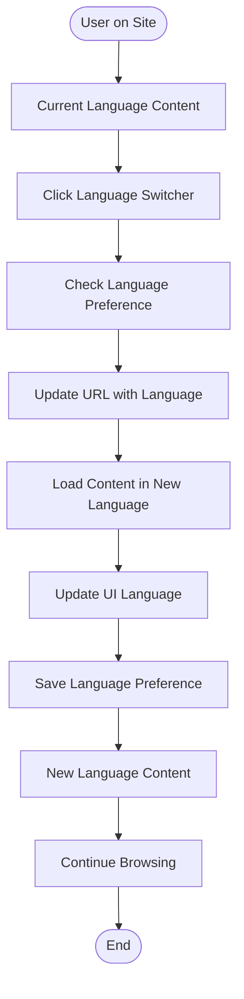
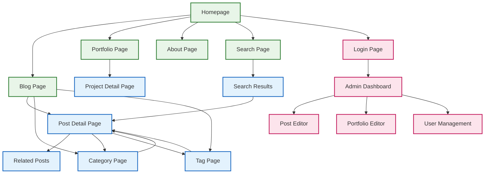
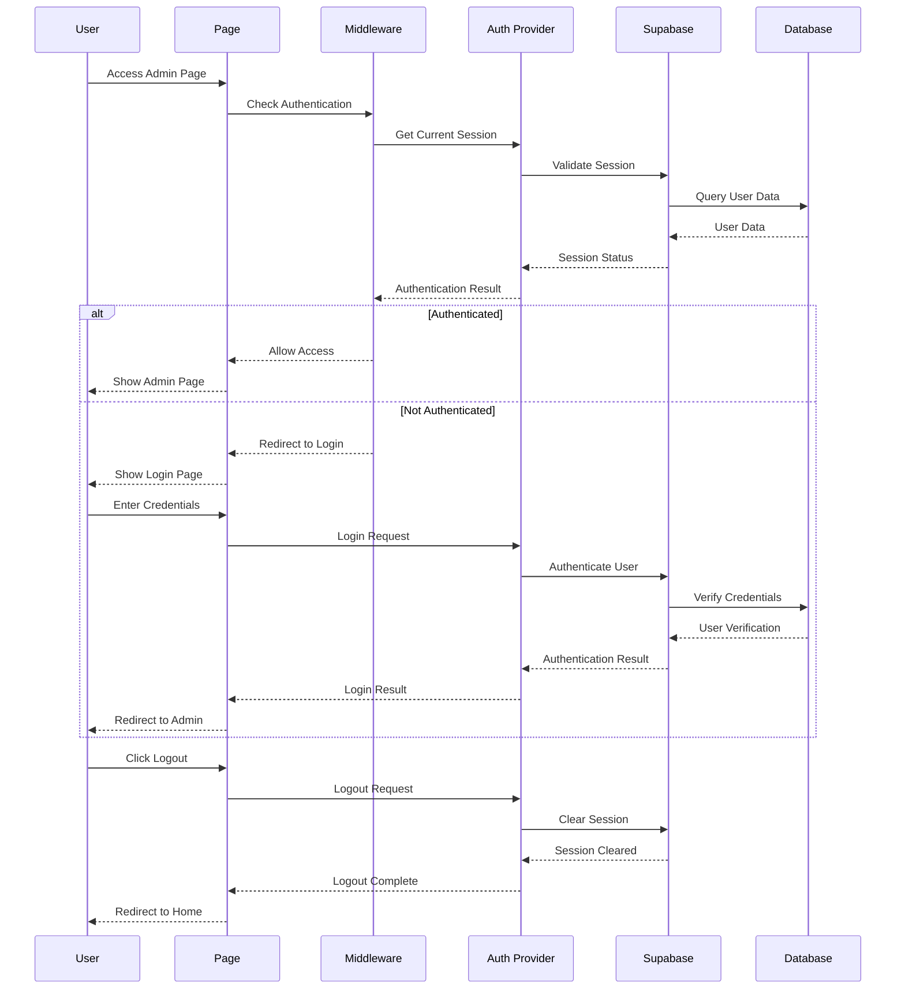
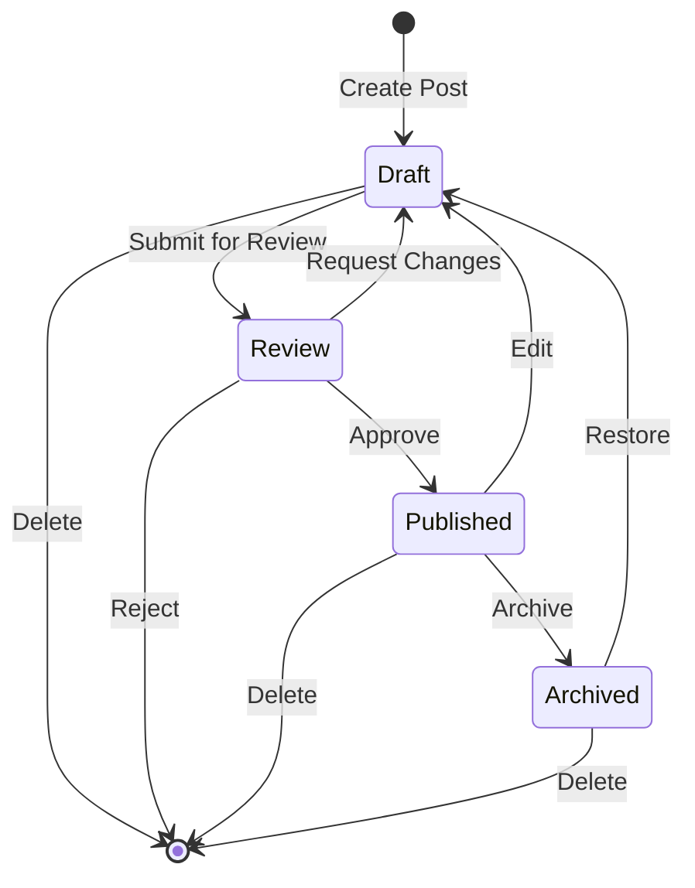
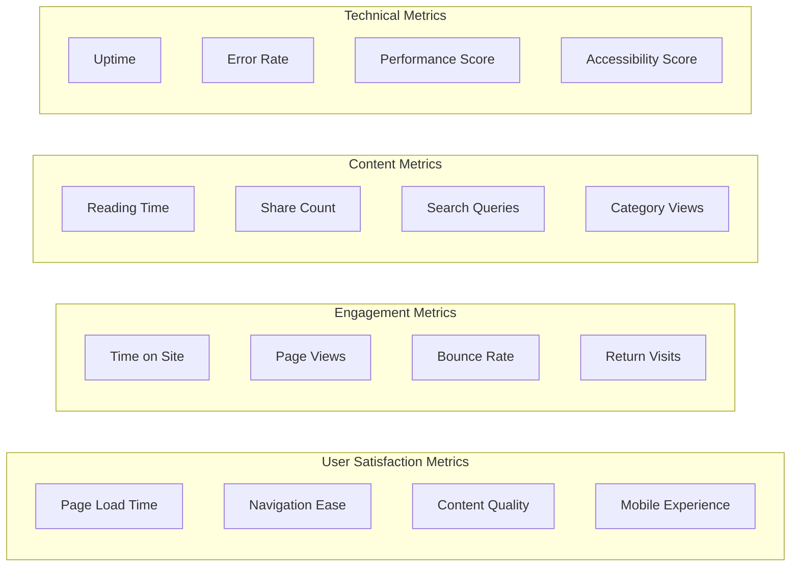

# User Journey Diagrams

## Admin User Journey

## Reader Journey

## Visitor Journey

## User Flow Diagrams

### Admin Content Creation Flow

### Reader Content Discovery Flow

### Language Switching Flow

## Page Navigation Flow

## Authentication Flow

## Content Management Workflow

## User Experience Metrics

